Deploying applications to an AKS cluster can be a complex and time-consuming process. But with Automated Deployments, you can automate your deployments and save time and effort.

AKS provides a fully managed Kubernetes cluster that makes it easy to deploy, manage, and scale your applications. And with automated deployments, you can streamline your deployment process and reduce the risk of errors.

With automated deployments, you can:

* Reduce the need for Kubernetes expertise: Automated deployments eliminate the need for Kubernetes expertise by automating the build and deployment process.
    
* Reduce the risk of errors: Automated deployments eliminate the risk of human error by automating the build (CI) process.
    
* Save time and effort: Automating your deployments saves time and effort by eliminating the need for manual intervention.
    
* Increase consistency: Automated deployments ensure that your deployments (CD) are consistent and repeatable.
    

With Automated Deployments you can streamline your integration and deployment process and focus on what really matters: releasing great application on AKS.

Automated Deployments automates the following four tasks:

* Generates a Dockerfile
    
* Generates a GitHub Actions (yaml) pipeline
    
* Generates two Kubernetes manifest
    
* Authenticates with GitHub Actions, ACR and AKS
    

## Prerequisites

To complete this tutorial, you need:

* An Azure subscription.
    
* A GitHub account.
    
* An application to deploy. If you don’t have an application to deploy, you can use the sample application in this tutorial.
    

## Create Azure Resources

To create the Azure resources, you’ll need for this tutorial, use the following Azure CLI commands:

```powershell
az group create --name myAKSDemo --location australiaeast

az aks create --resource-group myAKSDemo `
--name myAKSCluster `
--node-count 1 `
--enable-addons monitoring `
--generate-ssh-keys `
--kubernetes-version 1.28.0

az acr create --resource-group myAKSDemo `
--name automateddeployments `
--sku Basic
```

Azure Container Registry (ACR) is used to store our containers after they’re built in the Github Actions Workflow. The containers are then deployed into AKS after the Workflow runs the kubectl apply command.

## GitHub Repository

For this demo we’ll be using a (very) basic Flask app. Create a folder in the repo called “src” and a file named `app.py` and `requirements.txt` inside.

```python
from flask import Flask

app = Flask(__name__)

@app.route("/")
def hello_world():
    return "<h1>Hello World</h1>"

if __name__ == "__main__":
    app.run(debug=True)
```

```bash
Flask==2.3.3
```

Once you’ve committed those changes to your main branch, we can move on to automated deployments configuration.

## Configure Automated Deployments

In the Azure Portal, select your cluster and click on the **Automated Deployments** tab. Click on **Automatically containerize and deploy** to start the setup.

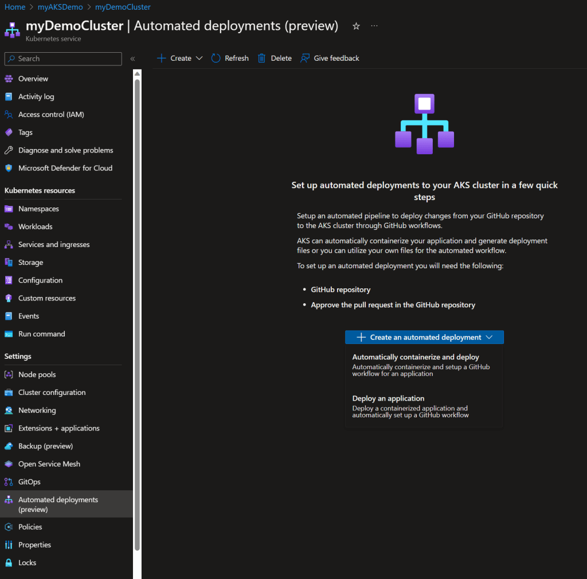

After you’ve authenticated with GitHub, select the repository you want to use for the deployment.

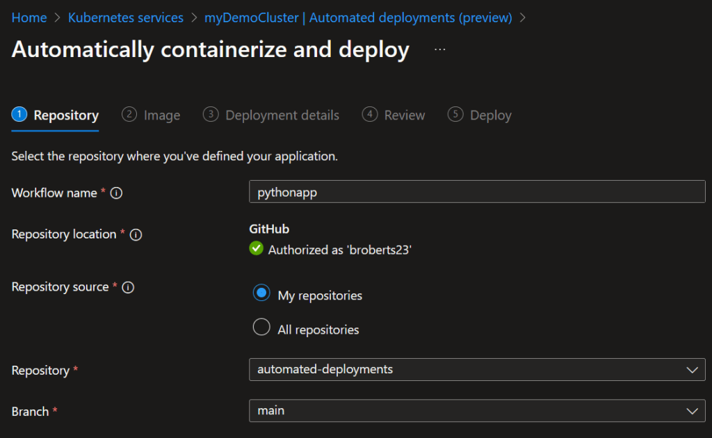

The wizard will automatically detect environment runtime. Fill in the port and location for the app.

Don’t forget to select the registry created above at the bottom of the page.

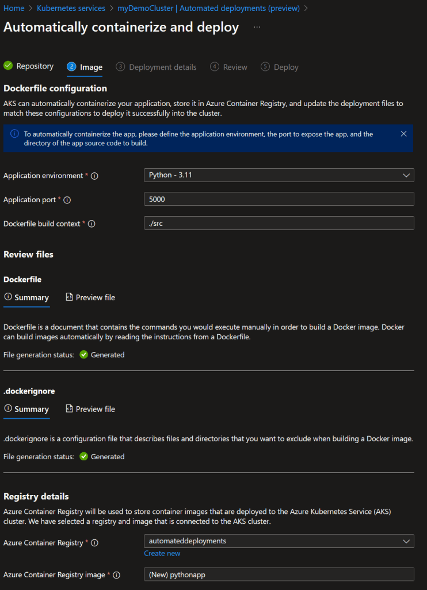

Create a new namespace for the project and proceed to the next step.

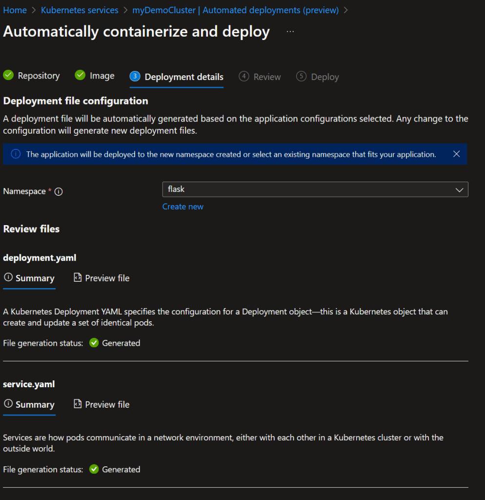

and click Deploy.

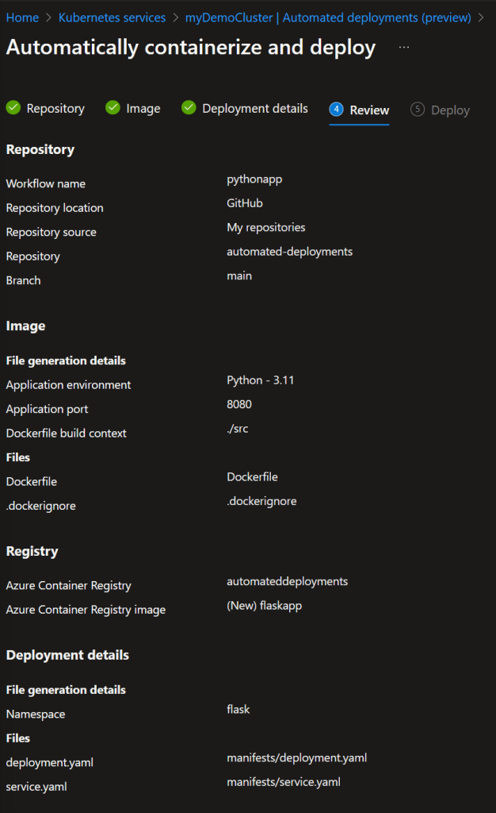

The automated deployment will now generate the credentials and set up permissions between GitHub Actions, the Container Registry and the AKS cluster.

The automated deployment will also create a pull request containing the new Dockerfile, GitHub Actions workflow and Kubernetes (yaml) manifest.

Clicking on “Approve pull request” will open the pull request in GitHub in a new tab.

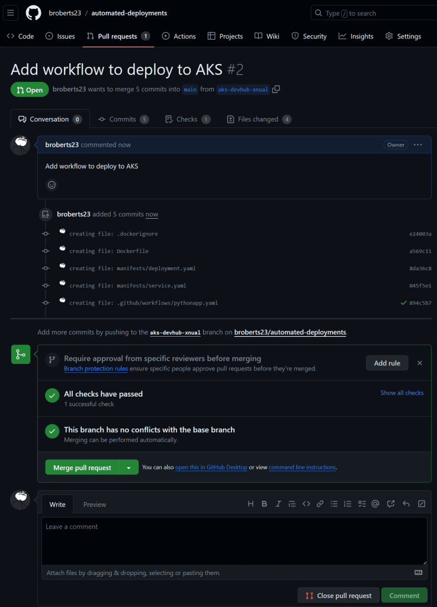

**Note:** The auto-generated entrypoint/cmd won’t work, update the Dockerfile to use the following instead.

`CMD [ "python3", "-m" , "flask", "run", "--host=0.0.0.0"`\]

Approve the merge and delete the branch then head to Action to see the build process.

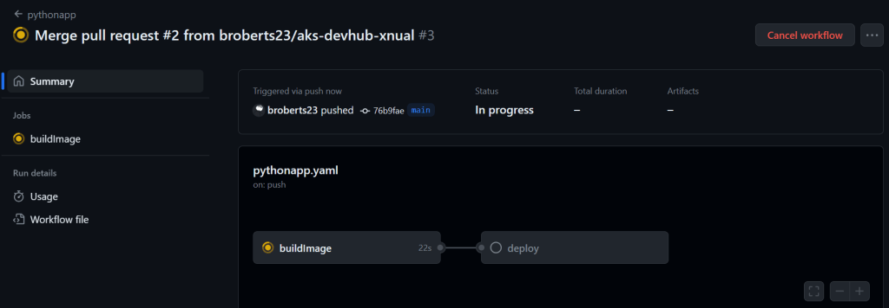

The pipeline will build the Docker image, push it to ACR and deploy it to AKS.

After a few minutes the deployment will be complete and the job status from the GitHub Actions pipeline will be reflected under the Automated Deployments tab in the Azure Portal.

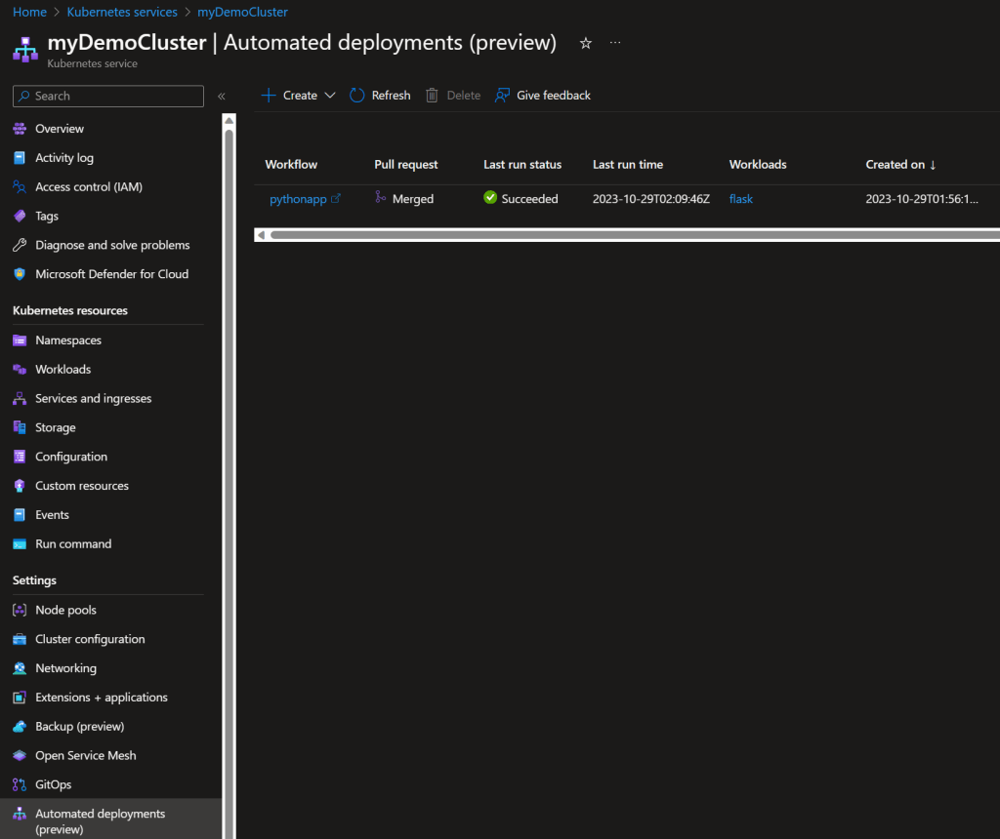

You can start to see how you might scale this out by adding more apps in different repo and/or branches.

Head up to “Services and ingress” to get the public IP address of the app.

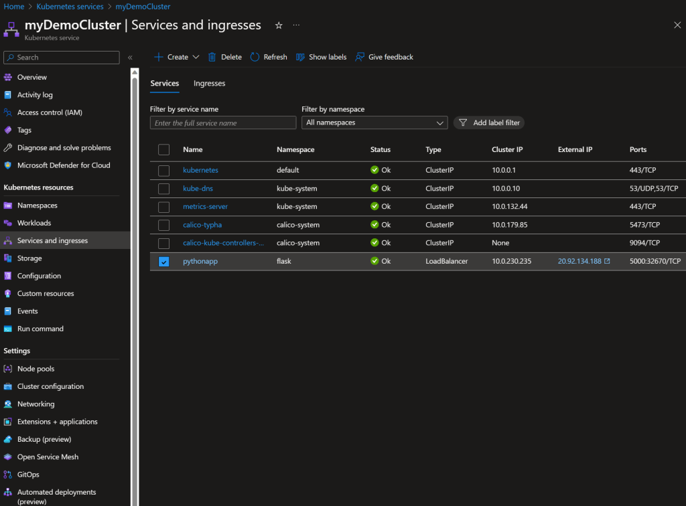

Clicking on the external IP will open a tab with the app.

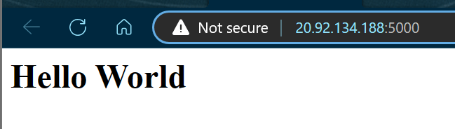

Success! 🤜🤛

You’ve deployed an application to AKS using without any knowledge of Kubernetes or Docker!

## Automated Deployments Demo

Now that we’ve got the basic configuration in place, let’s take a look at how automated deployments work.

This is best explained by modifying the code in the GitHub repo and seeing how the automated deployment process works.

Make a change to `app.py` and commit the changes to a new branch and create a pull request.

```python
from flask import Flask

app = Flask(__name__)

@app.route("/")
def hello_world():
    return "<h1>Hello World 2.0</h1>"

if __name__ == "__main__":
    app.run(debug=True)
```

`git checkout -b feature/website-update`

`git commit -am "added things"`

`git push --set-upstream origin feature/website-update`

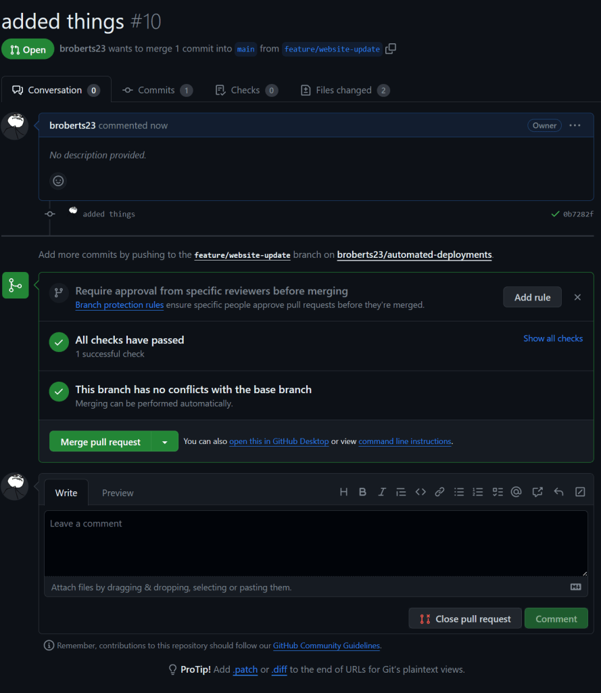

After completing the merge, observe the GitHub Actions pipeline.

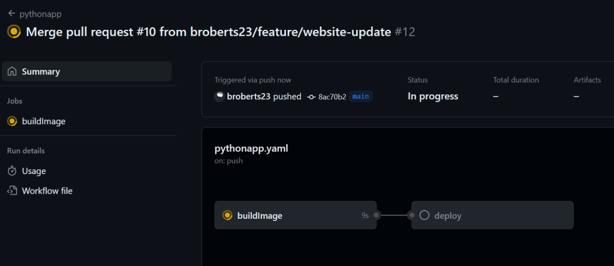

and the Azure Portal.

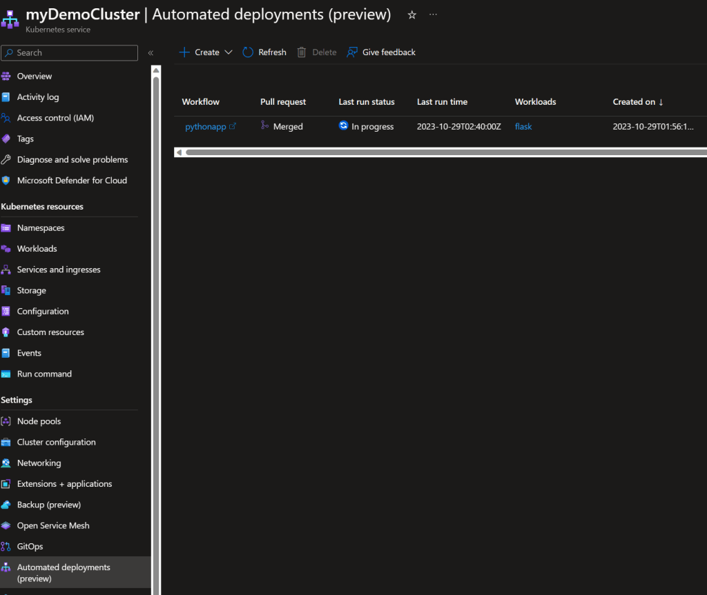

After the build is complete, refresh the tab with the app to see the changes.


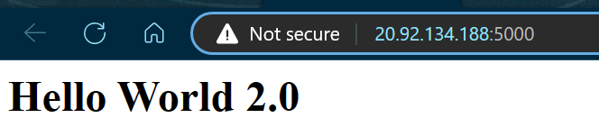

## Behind The Certains

The real magic is in the GitHub workflow.

```yaml
name: pythonapp
"on":
    push:
        branches:
            - main
    workflow_dispatch: {}
env:
    ACR_RESOURCE_GROUP: myAKSDemo
    AZURE_CONTAINER_REGISTRY: automateddeployments
    CLUSTER_NAME: myDemoCluster
    CLUSTER_RESOURCE_GROUP: myAKSDemo
    CONTAINER_NAME: pythonapp
    DEPLOYMENT_MANIFEST_PATH: |
        manifests/deployment.yaml
        manifests/service.yaml
jobs:
    buildImage:
        permissions:
            contents: read
            id-token: write
        runs-on: ubuntu-latest
        steps:
            - uses: actions/checkout@v3
            - uses: azure/login@<ID>
              name: Azure login
              with:
                client-id: ${{ secrets.AZURE_CLIENT_ID }}
                subscription-id: ${{ secrets.AZURE_SUBSCRIPTION_ID }}
                tenant-id: ${{ secrets.AZURE_TENANT_ID }}
            - name: Build and push image to ACR
              run: az acr build --image ${{ env.CONTAINER_NAME }}:${{ github.sha }} --registry ${{ env.AZURE_CONTAINER_REGISTRY }} -g ${{ env.ACR_RESOURCE_GROUP }} -f Dockerfile ./src
    deploy:
        permissions:
            actions: read
            contents: read
            id-token: write
        runs-on: ubuntu-latest
        needs:
            - buildImage
        steps:
            - uses: actions/checkout@v3
            - uses: azure/login@<ID>
              name: Azure login
              with:
                client-id: ${{ secrets.AZURE_CLIENT_ID }}
                subscription-id: ${{ secrets.AZURE_SUBSCRIPTION_ID }}
                tenant-id: ${{ secrets.AZURE_TENANT_ID }}
            - uses: azure/use-kubelogin@v1
              name: Set up kubelogin for non-interactive login
              with:
                kubelogin-version: v0.0.25
            - uses: azure/aks-set-context@v3
              name: Get K8s context
              with:
                admin: "false"
                cluster-name: ${{ env.CLUSTER_NAME }}
                resource-group: ${{ env.CLUSTER_RESOURCE_GROUP }}
                use-kubelogin: "true"
            - uses: Azure/k8s-deploy@v4
              name: Deploys application
              with:
                action: deploy
                images: ${{ env.AZURE_CONTAINER_REGISTRY }}.azurecr.io/${{ env.CONTAINER_NAME }}:${{ github.sha }}
                manifests: ${{ env.DEPLOYMENT_MANIFEST_PATH }}
                namespace: flask
```

Here’s a brief description of what’s happening:

* `az acr build` containerizes the latest version of the code from the Dockerfile and pushes it to the ACR.
    
* `azure/use-kubelogin@v1` and `azure/aks-set-context@v3` logs into the AKS cluster.
    
* `Azure/k8s-deploy@v4` deploys the new container image to AKS using `deployment.yaml`
    

## Not Without Its Flaws

During the process of writing this blog I tried three times to get the Automated Deployment to work:

* The first attempt I used a Python app that I hadn’t tested as a container,
    
* The second attempt I used a Node app that I had used on AKS before and,
    
* The third attempt I used a Go app that I had used with Docker locally.
    

Each time I ran into the same issue: the automated deployment process failed to generate a usable Dockerfile. So, I had to troubleshoot the issue with Docker locally before I could move on.

## Conclusion

Automated Deployments is a fantastic solution for abstracting away the complexities of containers builds and Kubernetes deployments. All you need is a basic understanding of Docker and you’ll have apps running on AKS in no time. I think it’s a great idea and the automation to generate the various files and pull request integration works really well, but the overall solution feels a bit… incomplete. I’d love to see the wizard get integration with an ingress controller to make it more than just a pod running on a cluster for a start, to bootstrap the blue/green or canary deployments. Similar to Azure Web App Slots.

As always, thanks for reading and happy coding!


If you’d like more information Automated Deployments, you can find it [here](https://learn.microsoft.com/en-us/azure/aks/automated-deployments).

## Cleanup

When you’re ready to delete your resources, you can use the following command to remove the resource group, AKS cluster, and all related resources.

`az group delete --name myAKSDemo --yes --no-wait`
