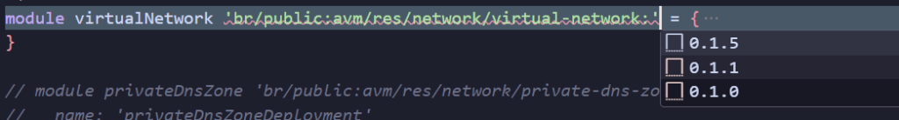
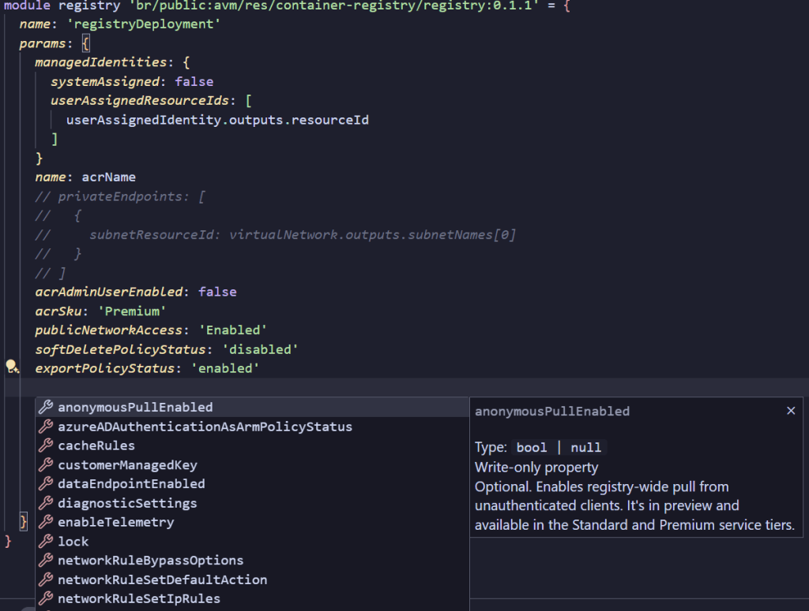
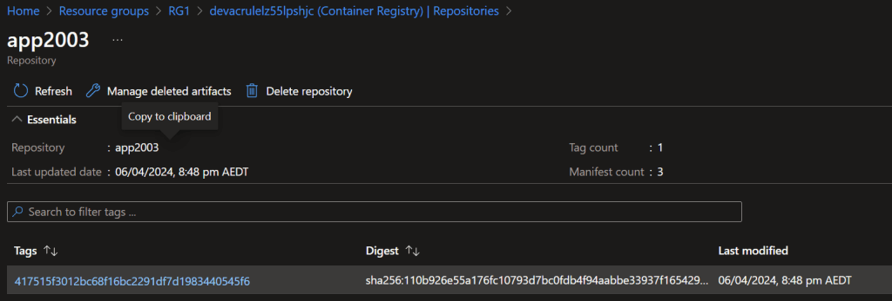

In this blog, I will be demonstrating how to use [Azure Verified Modules](https://azure.github.io/Azure-Verified-Modules/) (AVM) from the Azure Public Githib Repository. Azure Verified Modules are a set of pre-built, pre-tested, and pre-configured modules that allow you to quickly deploy and configure Azure services. These modules are built by Microsoft and are verified by the Azure team to ensure they meet specific quality standards such as the Azure Cloud Adoption Framework (CAF).

We will explore AVM and how you can use them to simplify your Azure deployments.

## What are Azure Verified Modules?

Azure Verified Modules are pre-built Terraform and Bicep modules that are designed to automate the deployment and configuration of Azure services. These modules are built using best practices and are verified by the Azure team to ensure they are secure, reliable, and efficient.

Azure Verified Modules are available in the [Bicep Registry](https://github.com/Azure/bicep-registry-modules) and can be easily imported into your Bicep configuration files. These modules can be used to deploy a wide range of Azure services, including virtual machines, storage accounts, databases, and many more.

## What are we building?

I’m working on a series of blogs where I need working web applications. I will be using container hosting services like Azure Container Instances, Azure Container Apps and Azure Kubernetes Service to host these applications. In this blog, I will be using AVM to deploy an Azure Container Registry, Managed Identity an VNET, then use GitHub Actions to deploy the infrasctucture resources and build then push a container image to the Azure Container Registry as a peice of reusable code I can run on-demand.

## Building the Azure Container Registry using Verified Modules

To get started, we need to deploy an Azure Container Registry using AVM. The Azure team and community have created excellent documentation on how to use AVM, and I will be following the steps outlined in the [Azure Container Registry module documentation](https://github.com/Azure/bicep-registry-modules/tree/main/avm/res/container-registry/registry#Usage-examples).

Here is the Bicep code to deploy the Azure Container Registry and supporting resources using AVM:

```bash
param location string
param environment string

var acrName = '${environment}acr${uniqueString(resourceGroup().id)}'
var vnetName = '${environment}-vnet-${uniqueString(resourceGroup().id)}'
var umiName = '${environment}-umi-${uniqueString(resourceGroup().id)}'

module userAssignedIdentity 'br/public:avm/res/managed-identity/user-assigned-identity:0.2.1' = {
  name: 'userAssignedIdentityDeployment'
  params: {
    name: umiName
    location: location
  }
}

module virtualNetwork 'br/public:avm/res/network/virtual-network:0.1.5' = {
  name: 'virtualNetworkDeployment'
  params: {
    addressPrefixes: [
      '10.0.0.0/16'
    ]
    name: vnetName
    location: location
    subnets: [
      {
        addressPrefix: '10.0.0.0/24'
        name: 'az-subnet-001'
        privateEndpointNetworkPolicies: 'Disabled'
        privateLinkServiceNetworkPolicies: 'Enabled'
      }
      {
        addressPrefix: '10.0.1.0/24'
        name: 'az-subnet-002'
      }
      {
        addressPrefix: '10.0.3.0/24'
        name: 'az-subnet-003'
      }
    ]
  }
}

module registry 'br/public:avm/res/container-registry/registry:0.1.1' = {
  name: 'registryDeployment'
  params: {
    managedIdentities: {
      systemAssigned: false
      userAssignedResourceIds: [
        userAssignedIdentity.outputs.resourceId
      ]
    }
    name: acrName
    acrAdminUserEnabled: false
    acrSku: 'Premium'
    publicNetworkAccess: 'Enabled'
    softDeletePolicyStatus: 'disabled'
    exportPolicyStatus: 'enabled'
    location: location
    tags: {
      Environment: environment
      'hidden-title': 'Container Registry'
      Role: 'DeploymentValidation'
    }
  }
}
```

In this code snippet, we are deploying an Azure Container Registry with a Premium SKU, enabling the export policy, and disabling the soft delete policy. We are also deploying a virtual network with three subnets and a user-assigned managed identity. The managed identity is used to authenticate the Azure Container Registry to future resources.

I’ve reduced the parameters and variables to a minimum to keep the code as readable as possible.

br/public is the namespace for AVM, and the avm/res/container-registry/registry module is used to deploy the Azure Container Registry. The module takes several parameters, including the name of the Azure Container Registry, the location, the SKU, and the network access settings.

A major benefit of using AVM is tab completion and/or Intellisense in your IDE. This makes it easier to discover the available modules versions, and their parameters, as well as the values that can be passed to the parameters.





## GitHub Actions for Infra Deployment

Now that we have the Bicep code to deploy the Azure Container Registry, we need to create a GitHub Actions workflow to deploy the infrastructure resources. Here is the GitHub Actions workflow that deploys the Azure Container Registry using AVM:

```yaml
name: Deploy Azure Infra

on: workflow_dispatch:

permissions:
  id-token: write
  contents: read

env:
  resource-group: RG1 # name of the Azure resource group

jobs:
  bicep-deploy:
    name: "Bicep Deploy"
    runs-on: ubuntu-latest
    environment: dev

    steps:
      # Checkout the repository to the GitHub Actions runner
      - name: Checkout
        uses: actions/checkout@v4

      # Authenticate to Az CLI using OIDC
      - name: "Az CLI login"
        uses: azure/login@v2
        with:
          client-id: ${{ secrets.AZURE_CLIENT_ID }}
          tenant-id: ${{ secrets.AZURE_TENANT_ID }}
          subscription-id: ${{ secrets.AZURE_SUBSCRIPTION_ID }}

      - name: Azure CLI script
        uses: azure/cli@v2
        with:
          azcliversion: 2.59.0
          inlineScript: |
            az deployment group create --resource-group ${{ env.resource-group }} --name rollout01 --template-file main.bicep --parameters main.bicepparam
```

In this GitHub Actions workflow, we are using the Azure/login and Azure/cli actions to authenticate to the Azure CLI and deploy the Bicep code to the Azure resource group. The workflow is triggered manually using the workflow\_dispatch event.

I’ve covered using OIDC to authenticate Github to Azure in depth in previous blogs. You can find more information on how to set up OIDC authentication in parts 4 and 5 of [Azure MLOps Challenge Blog](https://benroberts.io/azure-mlops-challenge-blog-index)

%[https://benroberts.io/azure-mlops-challenge-blog-index] 

## GitHub Actions for Container Deployment

Now that we have deployed the Azure Container Registry using Azure Verified Modules, we need to create a GitHub Actions workflow to build and push a container image to the Azure Container Registry. Here is the GitHub Actions workflow that builds and pushes a container image to the Azure Container Registry:

```yaml
name: Build and Push Docker image to ACR

on: workflow_dispatch:

permissions:
  id-token: write
  contents: read

env:
  REGISTRY_NAME: devacrulelz55lpsh # Set your registry name here
  IMAGE_NAME: app2003 # Set your image name here

jobs:
  build-and-push:
    runs-on: ubuntu-latest
    environment: dev

    steps:
      - name: Checkout code
        uses: actions/checkout@main

      - name: Set up Docker Buildx
        uses: docker/setup-buildx-action@v3

      - name: "Az CLI login"
        uses: azure/login@v2
        with:
          client-id: ${{ secrets.AZURE_CLIENT_ID }}
          tenant-id: ${{ secrets.AZURE_TENANT_ID }}
          subscription-id: ${{ secrets.AZURE_SUBSCRIPTION_ID }}

      - name: Login to ACR
        run: |
          az acr login --name ${{ env.REGISTRY_NAME }}

      - name: Build and push Docker image
        uses: docker/build-push-action@v5
        with:
          file: ./Dockerfile
          push: true
          tags: ${{ env.REGISTRY_NAME }}.azurecr.io/${{ env.IMAGE_NAME }}:${{ github.sha }}
```

In this GitHub Actions workflow, we are using the Docker/build-push-action to build and push a container image to the Azure Container Registry. We’re also using Azure RBAC authentication to the registry, opposed to the registry access keys of the Admin User login. The workflow is triggered manually using the workflow\_dispatch event.



## Conclusion

In this blog post, we explored Azure Verified Modules and how you can use them to simplify your Azure deployments. We deployed an Azure Container Registry using Azure Verified Modules and created a GitHub Actions workflows to deploy the infrastructure resources and build and push a container image to an Azure Container Registry.

Azure Verified Modules are a powerful tool that can help you automate the deployment and configuration of Azure services. By using Azure Verified Modules, you can save time and effort and ensure your deployments are secure, reliable, and efficient.

Azure Verified Modules offer significant benefits for businesses, particularly in terms of reducing the need to maintain internal registries, which can be time-consuming and resource-intensive. These modules are pre-built, tested, and verified by Microsoft, which means businesses can leverage them without worrying about their upkeep. By using Azure Verified Modules, businesses can focus more on their core operations and less on the maintenance of infrastructure code. Furthermore, these modules offer best practices and security, providing businesses with the assurance that they are using reliable and secure modules for their Azure deployments. This not only saves time and resources but also enhances the efficiency and reliability of business operations.

I hope you found this blog post helpful. Thank you for reading!


