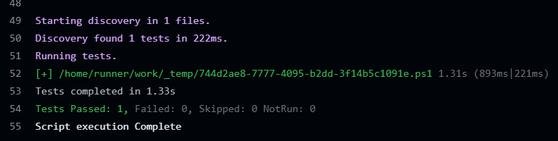

In the fast-paced world of cloud infrastructure, automation stands as the cornerstone of operational efficiency. Microsoft Azure, with its rich suite of tools and extensions, significantly enhances the deployment processes. Among these tools, the Custom Script Extension for Windows (and Linux) is particularly valuable. It allows users to execute custom scripts on virtual machines (VMs) during deployment, facilitating tailored configurations and setups without the need for manual intervention. In this blog post, we will explore how to harness the power of the Custom Script Extension to automate Windows VM deployments in Azure, with a special focus on leveraging Bicep templates.

## Overview of Custom Script Extension

The Azure Custom Script Extension is a powerful tool designed to streamline the execution of custom scripts on Azure virtual machines. This facilitates a variety of tasks such as post-deployment configurations, software installations, and other system customization. It supports a wide range of scripting languages, including PowerShell and Azure CLI, and integrates seamlessly with domain-specific languages (DSLs) such as Ansible, Bicep, and Terraform. Scripts can be sourced from Azure Storage, GitHub, or any accessible URL, ensuring flexibility across different deployment scenarios.

## Key Features

* **Script Execution**: The extension can execute scripts stored in locations like Azure Storage or GitHub, or directly from a specified URL.
    
* **Secure Execution**: Scripts are executed using Azure Managed Identity, enhancing security by eliminating the need for explicit credentials.
    
* **Script Output Logging**: Detailed logs are provided for script outputs, aiding in troubleshooting and audit processes.
    
* **Versioning and Updating**: Scripts can be version-controlled and updated seamlessly, ensuring consistency across deployments.
    

For more Features and Tips for Custom Script Extension, refer to the [Azure documentation](https://learn.microsoft.com/en-us/azure/virtual-machines/extensions/custom-script-windows#tips).

It’s important to keep in mind that the Custom Script Extensions executes scripts directly on the VM, inheriting the VM’s permissions and environment. Authentication mechanisms and network connectivity should be carefully managed to access internal and external resources securely.

## Custom Script Extension Use Cases

Custom Script Extensions (CSE) offer a versatile way to enhance and automate the configuration and management of Azure virtual machines (VMs) and virtual machine scale sets (VMSS). Here are several practical use cases where Custom Script Extensions can be particularly beneficial:

### **Enhancing a Base or Golden Image**

* **Scenario**: When deploying VMs from a standardized base image (often referred to as a “golden image”), it might lack specific software or configuration tweaks needed for particular applications or environments.
    
* **Use Case**: Use a Custom Script Extension to automatically install additional software packages, apply security patches, or configure system settings after the VM is instantiated from the golden image. This ensures that each deployed VM is immediately tailored to meet specific operational requirements without manual intervention.
    

### **Automated Software Deployment**

* **Scenario**: Continuous Integration/Continuous Deployment (CI/CD) environments require frequent updates and consistent configurations across multiple VMs.
    
* **Use Case**: Integrate Custom Script Extensions to deploy the latest version of your application automatically or perform necessary pre-deployment and post-deployment tasks such as configuring software or updating dependencies.
    

### **Environment Configuration**

* **Scenario**: Different environments (development, testing, production) often require different configurations and settings to function correctly.
    
* **Use Case**: Use Custom Script Extensions to modify configuration files, adjust environment variables, or execute scripts that tailor the VM’s environment to fit its intended role. This can include setting up database connections, configuring logging levels, or modifying network settings.
    

### **Security Hardening and Compliance**

* **Scenario**: Ensuring that VMs comply with organizational or regulatory security standards is crucial but can be time-consuming if performed manually.
    
* **Use Case**: Automate the process of hardening VMs by using Custom Script Extensions to apply security configurations, install security tools, enforce password policies, and disable unnecessary services. Scripts can be maintained in a central repository and updated as standards evolve.
    

### **Performance Tuning**

* **Scenario**: Optimal performance tuning often requires adjustments that are specific to the workload or the software that the VM is hosting.
    
* **Use Case:** Deploy scripts via Custom Script Extensions to tweak system parameters such as memory management settings, networking stack adjustments, or disk I/O performance settings. These enhancements can be crucial for performance-sensitive applications like databases or large-scale transaction systems.
    

## Custom Script Extension vs. PowerShell Desired State Configuration

When it comes to automating configurations and managing Azure virtual machines, both Custom Script Extensions (CSE) and PowerShell Desired State Configuration (DSC) are powerful tools. While CSE focuses on executing scripts to configure VMs during deployment or post-deployment, DSC takes a declarative approach to define and maintain a desired state for a VM’s configuration. DSC uses a declarative syntax to specify how a system should be configured, and it continuously ensures that the system remains in the desired state. On the other hand, CSE is imperative, executing scripts at specific points in time. DSC is particularly useful for ongoing configuration management and drift prevention, while CSE excels at one-time setup tasks and ad-hoc customization. However, CSE can also be used for ongoing management by triggering script execution on a schedule or in response to events. Ultimately, the choice between CSE and DSC depends on the specific requirements, with CSE offering flexibility and simplicity, and DSC providing a robust framework for maintaining consistent configurations over time. While powerful, PowerShell DSC can introduce complexity due to the requirement of packaging configurations, and deploying them through Azure Machine Configuration (Guest Configuration).

## Deployment Process

* **Script Preparation**: Write a PowerShell script tailored to meet the specific deployment needs, such as software installation or system configuration.
    
* **Integration with ARM Templates**: Embed the Custom Script Extension in an Azure Resource Manager (ARM) template, specifying the script to be executed during the VM setup.
    
* **Deployment via Azure Portal and Tools**: Deploy the VM through the Azure Portal, Azure CLI, or Azure PowerShell. The Custom Script Extension will automatically execute the PowerShell script post-deployment.
    
* **Monitoring and Troubleshooting**: Use tools like Azure Portal or Azure CLI to monitor the deployment and troubleshoot any potential issues.
    

## Best Practices and Considerations

* **Script Idempotency**: Design scripts so they can be safely rerun multiple times, which is essential for handling retries and resuming interrupted deployments.
    
* **Error Handling**: Scripts should include comprehensive error handling to manage failures and, if necessary, revert changes.
    
* **Security Measures**: Employ Azure Key Vault for managing sensitive data, use Managed Identity for script execution, and ensure scripts are accessible only to authorized users.
    
* **Version Control**: Maintain scripts under version control to track modifications and facilitate rollbacks when needed.
    
* **Testing and Validation**: Thoroughly test scripts in a non-production environment to confirm their functionality and identify any issues before widespread deployment.
    

## Example Scenario: Automating IIS Deployment with Custom Script Extension

Consider a scenario where we need to automate a website/app deployment on an Azure VM. Using Custom Script Extension with PowerShell, here’s how you might achieve this:

```powershell
# PowerShell script for automating IIS installation
Set-ExecutionPolicy RemoteSigned -Scope CurrentUser -Force

# Define configuration settings
$contentPath = "$Env:systemdrive\inetpub\wwwroot"
$gitHubRepoUri = "https://raw.githubusercontent.com/cloudacademy/static-website-example/master/index.html"

# Install IIS Role and Features
<#PSScriptInfo
.Synopsis
   Powershell script for Azure Bicep VM Extension to configure a Windows Web Server
.INPUTS
   No inputs are required for this script
.OUTPUTS
   No outputs are generated by this script
.NOTES
  Version:        0.1
  Author:         Ben Roberts
  Creation Date:  17/04/2024
  Purpose/Change: Initial script development
.
#>

# Update Script Execution Policy (temporarily allow script execution)
Set-ExecutionPolicy RemoteSigned -Scope CurrentUser -Force

# Define Configuration Settings (replace with your values)
$contentPath = "$Env:systemdrive\inetpub\wwwroot"
$gitHubRepoUri = "https://raw.githubusercontent.com/cloudacademy/static-website-example/master/index.html"

# Install IIS Role and Features
Try {
  Install-WindowsFeature -Name Web-Server -IncludeManagementTools
  Write-Host "IIS Role and Features installed successfully"
}
Catch {
  Write-Host $Error[0].Exception.Message
}

try {
  # Download static website content
  Invoke-WebRequest -Uri $gitHubRepoUri -OutFile "$contentPath\Default.htm"
  Write-Host "Website content cloned successfully"
}
catch {
  Write-Host $Error[0].Exception.Message
}

try {
  # Disable Unused Services
  $unusedServices = @("tapisrv", "WMPNetworkSvc", "ssh-agent")
  Stop-Service $unusedServices -ErrorAction SilentlyContinue
  Set-Service $unusedServices -StartupType Disabled
}
catch {
  Write-Host $Error[0].Exception.Message
}

try {
  # Configure Windows Firewall
  New-NetFirewallRule -DisplayName "Allow Inbound Port 80" -Direction Inbound -LocalPort 80 -RemotePort 80 -Protocol TCP -Action Allow
  Write-Host "Firewall rule configured successfully"
}
catch {
  Write-Host $Error[0].Exception.Message
}
# Update Script Execution Policy (revert to previous policy)
Set-ExecutionPolicy Bypass -Scope CurrentUser -Force

# Restart IIS service to apply configuration changes
Restart-Service W3SVC
```

For deployment, this script is integrated into a Bicep template that specifies the Custom Script Extension to execute the script on the Azure VM:

```bash
@description('VM Extension Properties.')
param extentionsProperties object = {
  extensionName: 'IIS'
  publisher: 'Microsoft.Compute'
  type: 'CustomScriptExtension'
  typeHandlerVersion: '1.10'
}

@description('Command to execute on the Virtual Machine.')
param commandToExecute string = 'powershell -File ConfigureWebServer_base.ps1'

resource vmExtension 'Microsoft.Compute/virtualMachines/extensions@2023-09-01' = {
  parent: vm
  name: extentionsProperties.extensionName
  location: location
  properties: {
    publisher: extentionsProperties.publisher
    type: extentionsProperties.type
    typeHandlerVersion: extentionsProperties.typeHandlerVersion
    autoUpgradeMinorVersion: true
    settings: {
      fileUris: [
        // Uri derived from the output of the deployment script: See uploadBlob.ps1
        deploymentScript.outputs.result
      ]
      commandToExecute: commandToExecute
    }
  }
}
```

For brevity I’ve omitted all the supporting configuration including the VM, VNET, Nic, Managed Identity, etc.

If you want the full context you can view the code here: [https://github.com/broberts23/azure-automation-dsc](https://github.com/broberts23/azure-automation-dsc)

If you’re wondering what the heck `deploymentScript.outputs.result` is, [checkout my blog](https://benroberts.io/2024/04/20/bicep-deployment-scripts-extending-azure-resource-deployment/) on Bicep Deployment Scripts where we uploaded the powershell script we’re consuming in the `fileUris` property:

%[https://benroberts.io/bicep-deployment-scripts-extending-azure-resource-deployment] 

## Deploying the Bicep Template

To deploy the Bicep template with the Custom Script Extension, we’ll be using a GitHib Action workflow. The workflow will, validate the Bicep file, and deploy the template to Azure, then for a little something extra, verify the website is up.

```yaml
name: Bicep Deployment and Pester Test

on:
  workflow_dispatch:

# OICD Auth
permissions:
  id-token: write
  contents: read

env:
  resource-group: RG1 # name of the Azure resource group
  rollout-name: rollout01 # name of the deployment
  environment: dev

jobs:
  validate:
    name: Validate Bicep template
    runs-on: ubuntu-latest
    environment: dev
    steps:
      - name: Checkout code
        uses: actions/checkout@v4

      - name: Login via Azure CLI
        uses: azure/login@v2
        with:
          client-id: ${{ secrets.AZURE_CLIENT_ID }}
          tenant-id: ${{ secrets.AZURE_TENANT_ID }}
          subscription-id: ${{ secrets.AZURE_SUBSCRIPTION_ID }}

      - name: Bicep Validate
        id: validate
        uses: azure/CLI@v2
        with:
          azcliversion: latest
          inlineScript: |
            az deployment group validate --resource-group ${{ env.resource-group }} --name  ${{ env.rollout-name }} --template-file vm_dsc.bicep --parameters adminPassword=${{ secrets.ADMINPASSWORD }}


  deploy_and_test:
    name: Deploy and Test
    runs-on: ubuntu-latest
    environment: dev
    needs: [validate]
    steps:
      - name: Checkout code
        uses: actions/checkout@v4
      
      - name: Login via Azure CLI
        uses: azure/login@v2
        with:
          client-id: ${{ secrets.AZURE_CLIENT_ID }}
          tenant-id: ${{ secrets.AZURE_TENANT_ID }}
          subscription-id: ${{ secrets.AZURE_SUBSCRIPTION_ID }}
    
      - name: Deploy Bicep template
        id: deploy
        uses: azure/CLI@v2      
        with:
          azcliversion: latest
          inlineScript: |
            az deployment group create --resource-group ${{ env.resource-group }} --name  ${{ env.rollout-name }} --template-file vm_dsc.bicep --parameters adminPassword=${{ secrets.ADMINPASSWORD }}
            # Get the public IP address of the deployed VM from the bicep output
            publicIP=$(az deployment group show --resource-group ${{ env.resource-group }} --name  ${{ env.rollout-name }} --query 'properties.outputs.publicIP.value' -o tsv)
            echo "publicIP=$publicIP" >> $GITHUB_OUTPUT

      - name: Testing Website Accessibility
        uses: azure/powershell@v2
        with:
          azPSVersion: "latest"
          inlineScript: |
            Import-Module Pester
            $url = "http://${{ steps.deploy.outputs.publicIP }}"
            Describe "Website Accessibility Test" {
                It "Website should be accessible" {
                    $response = Invoke-WebRequest -Uri $url -UseBasicParsing -ErrorAction SilentlyContinue
                    $response.StatusCode | Should -Be 200
                }
            }
```



## Conclusion

The Custom Script Extension, when combined with Bicep, provides a powerful solution for automating and streamlining cloud deployments in Azure. By leveraging this approach, IT administrators and DevOps teams can ensure more consistent, secure, and efficient deployment processes. The example provided here demonstrates just one of the myriad possibilities, encouraging users to explore this tool-set for diverse automation tasks in Azure environments.

I hope you enjoyed this blog post and found it valuable. Stay tuned for more insights and tutorials on cloud computing, automation, and infrastructure management. Happy automating!


