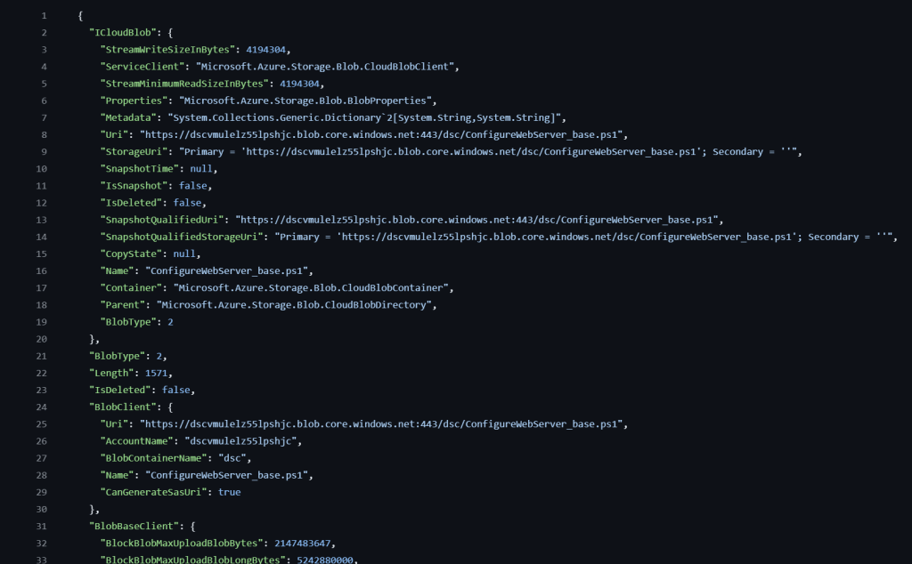

Hey there tech enthusiasts! Today, let’s dive into the world of Azure deployment scripts using Bicep, Microsoft’s DSL for Azure Resource Manager templates. Bicep Deployment Scripts are a powerful tool that enhances the deployment of Azure resources by combining the flexibility of Bicep with the power of PowerShell or Azure CLI.

## What are Bicep Deployment Scripts?

[Bicep Deployment Scripts](https://learn.microsoft.com/en-us/azure/azure-resource-manager/bicep/deployment-script-bicep?tabs=CLI) are essentially PowerShell or Azure CLI scripts that streamline, enhance or augment the deployment process of Azure resources using Bicep `resources`. They offer a cleaner and more concise way to execute command in-stream of the deployment process, making it easier to define and deploy Azure resources. Deployment scripts can be used to automate the provisioning of Azure resources, configure settings, and execute custom actions during deployment that can then be referenced in the Bicep template by other resources and/or modules.

Deployment scripts execute in a Container Instance and Storage Account which are created as part of the deployment process. Note that there are costs associated with the Container Instance and Storage Account, so be mindful of which properties you use to delete or keep the resources after deployment.

## Why Bicep?

First off, if you’re not familiar with Bicep, imagine ARM json templates but with a much friendlier syntax. Bicep simplifies the process of defining Azure resources by providing a more readable and maintainable format. If you’ve ever felt overwhelmed by the complexity of ARM templates, Bicep is your ticket to a smoother deployment experience.

## Getting Started with Bicep Deployment Scripts

To kick things off, make sure you have the PowerShell and Bicep installed on your machine or developer environment. Once you’re all set up, writing your first Bicep Deployment Script is a breeze. In this example, we’ll create a simple Bicep module that executes a simple PowerShell script that uploads a file we’ll use in an upcoming blog. Below is a snippet of the Bicep module, i’ve omitted the supporting resources (User Assigned Identity, VNET’s, Storage Account, etc.) from the snippet for brevity:

```yaml
resource deploymentScript 'Microsoft.Resources/deploymentScripts@2023-08-01' = {
  name: 'inlinePS'
  location: location
  kind: 'AzurePowerShell'
  identity: {
    type: 'UserAssigned' // User Assigned Identity for the Deployment Script to access the Storage Account
    userAssignedIdentities: {
      '${umi.id}': {}
    }
  }
  properties: {
    azPowerShellVersion: '11.4'
    retentionInterval: 'PT1H'
    cleanupPreference: 'OnSuccess'
    environmentVariables: [
      {
        name: 'AZURE_STORAGE_ACCOUNT'
        value: storageAccount.name
      }
      {
        name: 'CONTENT' // Imports the content of a file - in this case, another
        // PowerShell script - that will be uploaded to the Storage Account
        // This is stored in an Environment Variable as a string
        value: loadTextContent('ConfigureWebServer_base.ps1')
      }
      {
        name: 'AZURE_RESOURCE_GROUP'
        value: resourceGroup().name
      }
    ]
    // arguments: saName
    scriptContent: loadTextContent('uploadBlob.ps1')
  }
  dependsOn: [
    // This ensures that the Storage Account and role assignment are created before the deployment script
    roleAssignment
  ]
}

output result string = deploymentScript.properties.outputs.text.ICloudBlob.Uri
```

In this module, we define a `deploymentScript` resource that executes an Azure PowerShell script (uploadBlob.ps1) via the `scriptContent` property. The environment variables are used to pass parameters to the script, such as the Storage Account name and the content of the file. The `loadTextContent` function is used to import the content of both PowerShell scripts (plain text) from local files and store them as an environment variables.

Note the `cleanupPreference` property is set to ‘OnSuccess’, which means the Container Instance and Storage Account created to execute the script will only be deleted after a successful execution. This is handy for troubleshooting a failing script, you won’t have to wait for the container instance to be created on subsiquent runs. However, this might not be ideal at scale as developers could leave failed deployments undeleted, leading to wasted spend.

Let’s have a quick look at the PowerShell script called by `scriptContent`:

```powershell
<#PSScriptInfo
.Synopsis Powershell script to upload a file to a blob storage account
.INPUTS The input to this script are the environment variables set by the DeploymentScript Bicep resource
.OUTPUTS The output of this script is returned as a DeploymentScript output ($DeploymentScriptOutputs) as the 'text' key. This is later interpreted by the DeploymentScript to get the Uri of the uploaded file.
.NOTES
Version: 0.1
Author: Ben Roberts
Creation Date: 17/04/2024
Purpose/Change: Initial script development
#>

# Connect to Azure using Managed Identity defined in the Deployment Script resource
try {
    Connect-AzAccount -Identity
} catch {
    Write-Host "Failed to connect to Azure"
    exit 1
}

# Get the storage account context
$saContext = Get-AzStorageAccount -Name "${env:AZURE_STORAGE_ACCOUNT}" -ResourceGroupName "${env:AZURE_RESOURCE_GROUP}"
$workingContext = $saContext.Context

# Output the script from the environment variable to a file
Write-Output "${env:CONTENT}" > ConfigureWebServer_base.ps1

# Upload the file to the blob storage account
try {
    $output = Set-AzStorageBlobContent -File ConfigureWebServer_base.ps1 -Container dsc -Blob ConfigureWebServer_base.ps1 -Context $workingContext -Force
} catch {
    Write-Host $Error[0].Exception.Message
}

# Output the results to the built-in DeploymentScript variable using the 'text' key
$DeploymentScriptOutputs = @{}
$DeploymentScriptOutputs['text'] = $output # See results.json for an example of $output
```

This script authenticates to Azure using the Managed Identity defined in the Deployment Script resource, retrieves the Storage Account context, and uploads the content of the second PowerShell script to a container in the Storage Account. The output of the script is stored in the `$DeploymentScriptOutputs` variable, which is a common variable that can be accessed by the DeploymentScript resource and surfaced by Azure Resource Manager. This can be referenced in the Azure portal, or using the Azure PowerShell cmdlet `Get-AzDeploymentScript`

## Deployment Scripts Outputs

The output is stored in the `text` key of the `$DeploymentScriptOutputs` variable, which can be output to a variable in the Bicep template. This allows you to reference the output of the script in other resources or modules.

output result string = deploymentScript.properties.outputs.text.ICloudBlob.Uri

`deploymentScript.properties.outputs.text` is a JSON object. We can access the `ICloudBlob.Uri` property to get the URI of the uploaded file. This output can then be used in other resources or modules to reference the uploaded file by using `deploymentScript.outputs.resut`. We’ll make use of this in an upcoming blog.



## Multi-line Scripts

As an alternative to the passing the deployment script as a `ps1` file, you can also pass the script as a multi-line string in the Bicep by using three quotes \`”’\`. This can be useful for small scripts that don’t require a separate file. Here’s an example of how you can define a multi-line script in a Bicep file:

```bash
param storageAccountName = 'myStorageAccount'
param rgName = resourceGroup().name

resource deploymentScript 'Microsoft.Resources/deploymentScripts@2023-08-01' = {
  name: 'inlinePS'
  location: location
  kind: 'AzurePowerShell'
  properties: {
    azCliVersion: '11.4'
    arguments: '-name ${storageAccountName} -rgName ${rgName}'
    scriptContent: '''
      param (
        [string] $name,
        [string] $rgName
      )
      $output = az storage account create -n $name -g $rgName --sku Standard_LRS
      $DeploymentScriptOutputs = @{}
      $DeploymentScriptOutputs['text'] = $output
    '''
  }
}

output result object = deploymentScript.properties.outputs.text
```

## Idempotent Scripts

Deployment script execution is designed to be idempotent, meaning that if there are no changes to any of the deploymentScripts resource properties, including the inline script, the script will not run upon redeployment of the Bicep file. The deployment script service compares resource names in the Bicep file with existing resources in the same resource group.

To run the same deployment script multiple times, you have two options: either change the name of your deploymentScripts resource, perhaps using the `utcNow` function as the resource name or as part of it (note that `utcNow` can only be used in the default value for a parameter), changing the resource `name` (“inlinePS” in my example) creates a new deploymentScripts resource; or specify a different value in the `forceUpdateTag` property, such as `utcNow`.

Writing deployment scripts with idempotence in mind ensures that accidental reruns won’t lead to unintended system alterations. For instance, let’s say you’re deploying an Azure virtual machine using a deployment script. Before creating the VM, the script should check if a VM with the same name already exists. If it does, the script can either skip VM creation or delete the existing VM and recreate it with updated configurations. This approach guarantees that running the script multiple times won’t result in duplicate VMs or unexpected changes to existing ones, maintaining system integrity and minimizing errors in the deployment process.

## Conclusion

Bicep Deployment Scripts are a game-changer for Azure resource deployment. By combining the simplicity of Bicep with the power of PowerShell, you can streamline your deployment process and automate complex workflows with ease. Whether you’re a seasoned Azure pro or just getting started, Bicep Deployment Scripts are a must-have tool in your arsenal.

Stay tuned for the next blog post where we’ll explore how to use Custom Script Extension to deploy a custom web server configuration to an Azure VM, using the PowerShell script we just uploaded to the Storage Account. Until then, happy coding!


