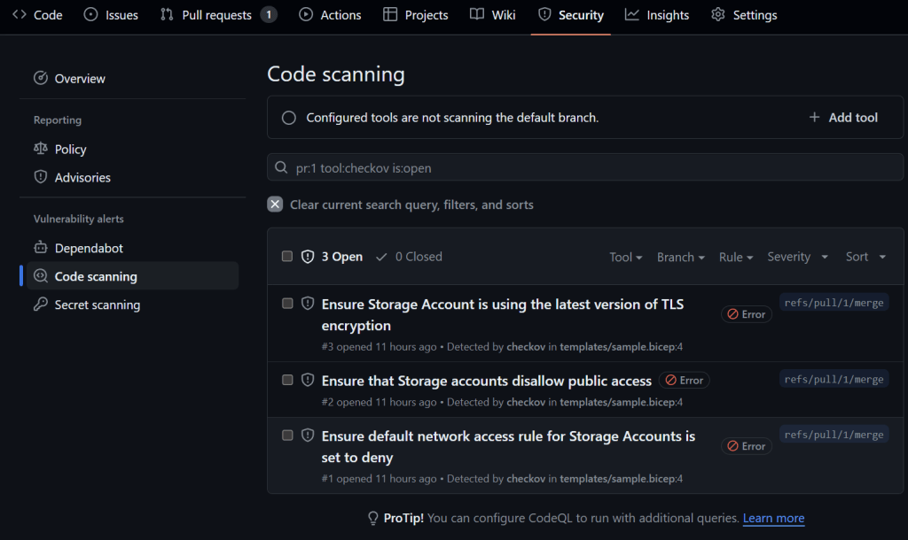
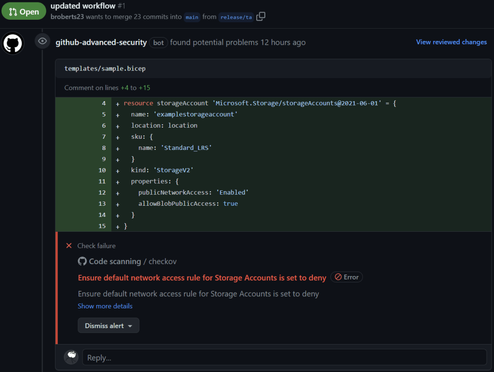
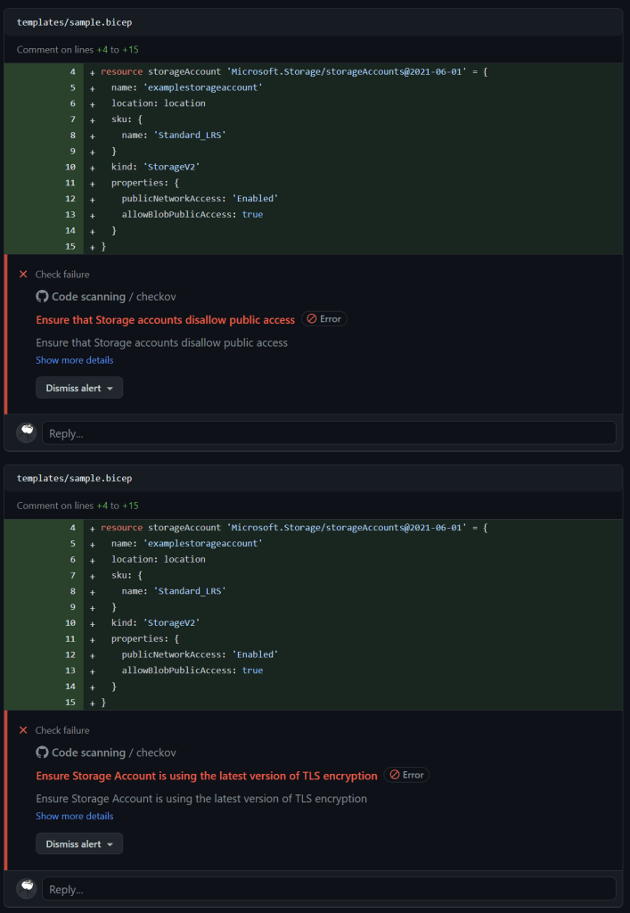
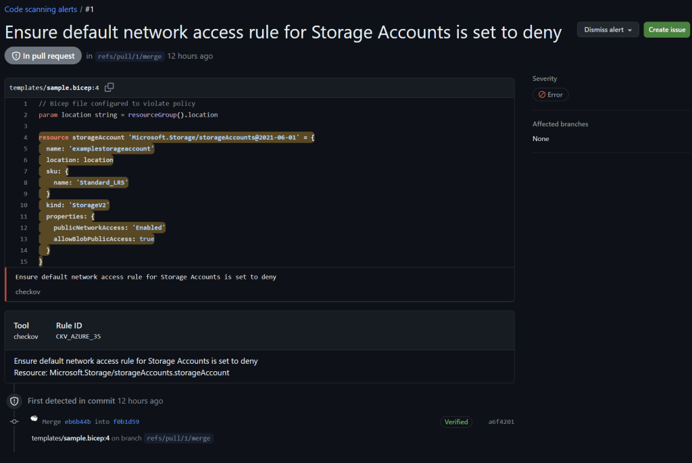

In the world of infrastructure as code (IaC), ensuring that your templates and scripts adhere to best practices for security, compliance, and reliability is paramount. Azure Bicep, a domain-specific language for deploying Azure resources, is no exception. With the increasing complexity and scale of cloud deployments, the need for automated tools to scan and secure IaC has never been more critical. One such tool that stands out in this space is Checkov.

## What is Checkov?

Checkov is an open-source static code analysis tool designed to help developers prevent cloud misconfigurations during the build phase of infrastructure development. Developed by Bridgecrew ([aquired by Palo Alto Networks in 2021](https://www.paloaltonetworks.com/company/press/2021/palo-alto-networks-completes-acquisition-of-bridgecrew#:~:text=Bridgecrew%20co%2Dfounders%2C%20Idan%20Tendler,equity%20awards%20to%20acquire%20Bridgecrew.)), a company specializing in cloud security, Checkov is available under the Apache License 2.0, allowing anyone to freely use, modify, and distribute it. It supports scanning a variety of infrastructure as code (IaC) formats including Terraform, CloudFormation, Kubernetes, ARM Templates, and notably, Azure Bicep. A key advantage of Checkov is its native support for Azure Bicep, meaning it can directly scan Bicep files without needing to compile them into JSON format first. This capability enhances the “shift left” approach of DevSecOps by integrating security checks early into the development workflow, thus enabling developers to detect and rectify potential security issues before they become embedded in the deployment process. By using Checkov, teams can significantly reduce vulnerabilities and ensure robust compliance and security practices from the outset of their projects.

## Benefits of Using Checkov with Azure Bicep

Checkov provides several advantages for teams working with Azure Bicep files, enhancing security and compliance throughout the development lifecycle:

* **Prevention of Misconfigurations**: By scanning Azure Bicep files, Checkov identifies potential security issues and misconfigurations before they are deployed, helping to prevent costly and risky errors in live environments.
    
* **Comprehensive Policy Library**: Checkov includes over 1000 built-in policies that cover a wide range of security best practices and compliance standards across multiple cloud providers, including Azure. This extensive library ensures that your infrastructure meets rigorous security and compliance benchmarks.
    
* **Custom Policy Creation**: Users have the flexibility to create custom policies in Checkov. This feature allows organizations to tailor the tool to meet specific security needs and organizational standards, providing a highly adaptable security solution.
    
* **Seamless Integration**: Checkov can be easily integrated into CI/CD pipelines, providing continuous security and compliance assessments without disrupting development workflows.
    
* **Scanning for CVEs**: Checkov performs Software Composition Analysis (SCA) to scan open source packages and container images for Common Vulnerabilities and Exposures (CVEs), adding an additional layer of security by identifying known vulnerabilities in dependencies.
    

These features make Checkov an invaluable tool for teams aiming to enhance the security and integrity of their Azure Bicep deployments.

## Aligning Checkov with Azure Cloud Security Benchmarks

While Checkov provides extensive coverage of security best practices and compliance rules, its direct alignment with the Azure Cloud Security Benchmark might not be *explicitly* detailed for every rule. However, many of Checkov’s rules are broadly applicable to Azure and adhere to general security best practices that overlap significantly with Azure’s benchmarks. For organizations aiming to specifically meet Azure’s security standards, Checkov allows for the customization and extension of rules (defined in yaml), enabling teams to tailor security checks to the unique requirements of the Azure Cloud Security Benchmark or custom Azure Policy definitions. . This combination ensures a robust compliance and security strategy that is well-aligned with Microsoft’s cloud security benchmark (MCSB).

## Integrating Checkov with GitHub Actions for Azure Bicep Scanning

Incorporating [Checkov into your GitHub Actions](https://github.com/marketplace/actions/checkov-github-action) workflow can significantly enhance the security posture of your Azure Bicep deployments. Checkov, a static code analysis tool (SCAT), scans infrastructure as code (IaC) for misconfigurations and potential security issues. Here’s how to set up Checkov with GitHub Actions for Azure Bicep files.

In this example, the Bicep file creates a storage account with public network access enabled and allows public access to blobs. Running Checkov on this file will flag these configurations as security issues, helping you identify and rectify potential vulnerabilities before deployment.

## Workflow Setup

Start by defining the workflow in your repository’s `.github/workflows` folder. Here’s an effective configuration example:

```yaml
name: Azure Bicep Template Analysis

on:
  pull_request:
    branches: [main]
  push:
    branches: [/release/*]

jobs:
  checkov-scan:
    runs-on: ubuntu-latest
    name: Checkov Bicep Analysis
    permissions:
      contents: read # Allows actions/checkout to fetch the code
      security-events: write # Allows github/codeql-action/upload-sarif to upload SARIF results

    steps:
      - name: Checkout Repository
        uses: actions/checkout@v4

      - name: Run Checkov Action
        id: checkov
        uses: bridgecrewio/checkov-action@v12
        with:
          directory: templates/
          quiet: true # Display only failed checks
          soft_fail: true # Do not return an error code if there are failed checks
          framework: bicep # Specify to run checks only on Azure Bicep templates
          output_format: sarif # Set output format to SARIF for integration with GitHub security tab
          output_file_path: results.sarif # Specify the file path for the SARIF output
          download_external_modules: true # Enable downloading external modules

      - name: Upload SARIF Results to GitHub
        if: always() # Ensure this step runs regardless of previous steps' success or failure
        uses: github/codeql-action/upload-sarif@v3
        with:
          sarif_file: results.sarif
```

### Benefits of Using SARIF Output

* **SARIF (Static Analysis Results Interchange Format)** is a standard output format that enhances the interoperability between different security tools and services. By configuring Checkov to generate SARIF output, you can leverage GitHub’s native capabilities to display and manage security findings effectively:
    
* **Centralized Security Findings**: The SARIF file generated by Checkov is uploaded to GitHub where it integrates seamlessly within th pull request. This centralization makes it easier for teams to review, discuss, and remediate any detected issues directly within their development environment.
    

Next, define the bicep files you want to scan in the `templates/` directory. You can adjust the `directory` parameter in the workflow configuration to match your repository’s structure. Once you’ve set up the workflow, every pull request targeting the `main` branch or any push to the `release/`\* branches will trigger the Checkov scan for Azure Bicep templates.

```go
param location string = resourceGroup().location

resource storageAccount 'Microsoft.Storage/storageAccounts@2021-06-01' = {
  name: 'examplestorageaccount'
  location: location
  sku: {
    name: 'Standard_LRS'
  }
  kind: 'StorageV2'
  properties: {
    publicNetworkAccess: 'Enabled'
    allowBlobPublicAccess: true
  }
}
```

After the workflow runs, validate that the Checkov scan results are displayed in the GitHub Security tab. This integration provides a clear overview of the security findings, allowing you to address any issues promptly.



The Checkov scan results are also populate in the pull request and highlight the offending resource:







## Securing Infrastructure as Code with Advanced Compliance and Privacy Controls

Enterprises, particularly those operating within highly regulated industries or handling sensitive data, must prioritize robust security measures. The use of Checkov for scanning Azure Bicep files can be a cornerstone of such an approach, ensuring that infrastructure deployments are secure by design. However, for these organizations, using public GitHub Actions might not align with their stringent security protocols due to concerns about data privacy and unauthorized access.

A viable solution for these enterprises is to integrate Checkov within a privately hosted GitHub Actions runner. This setup combines the flexibility and power of GitHub Actions with the security controls that enterprises require. For instance, by using private runners, enterprises can ensure that their codebase and critical infrastructure configurations do not leave their controlled environments. Moreover, using paid solutions like Prisma Cloud Enterprise or Snyk IaC+ can further enhance this setup. Prisma Cloud, a comprehensive cloud security product, incorporates Checkov to provide advanced security scanning, compliance monitoring, and threat detection capabilities tailored to enterprise needs.

## Conclusion

Using Checkov with GitHub Actions to scan Azure Bicep files introduces a robust layer of security to your infrastructure deployment practices. By automating the security scanning process, this integration ensures that your cloud resources are deployed not only efficiently but also with a high standard of security. This proactive approach significantly reduces the risk of deploying flawed or vulnerable infrastructure, thereby safeguarding your systems against potential threats.

As cloud environments grow in complexity, the integration of sophisticated tools like Checkov into CI/CD pipelines becomes indispensable. Such tools enable organizations to adhere to best practices effortlessly, ensuring continuous compliance and security. In summary, leveraging Checkov with GitHub Actions empowers organizations to maintain rigorous security standards while fully embracing the benefits of infrastructure as code. This is crucial for building resilient systems that can thrive in today’s dynamic and challenging digital landscape.
