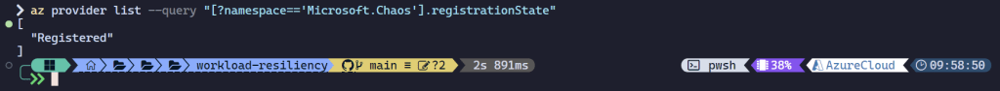
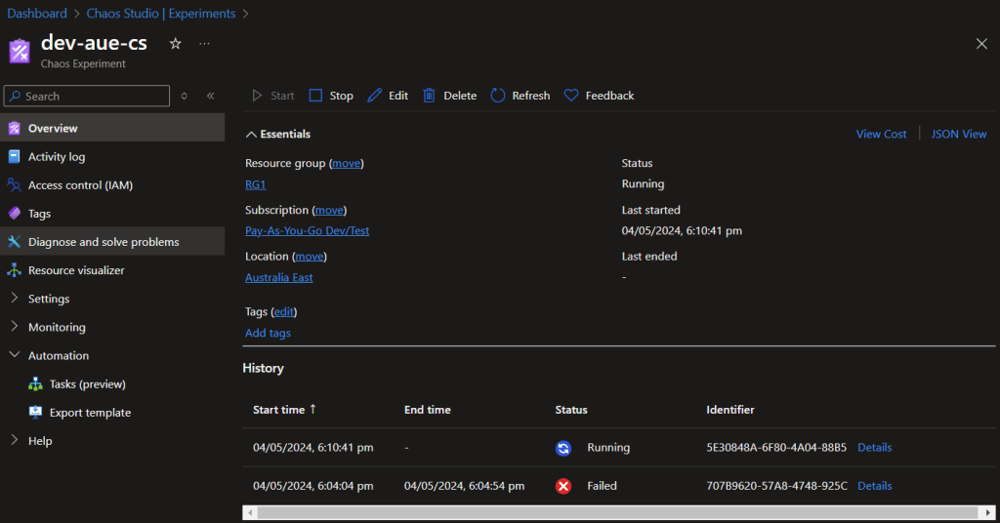
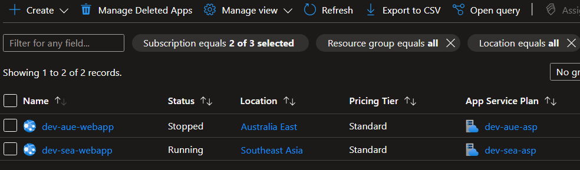
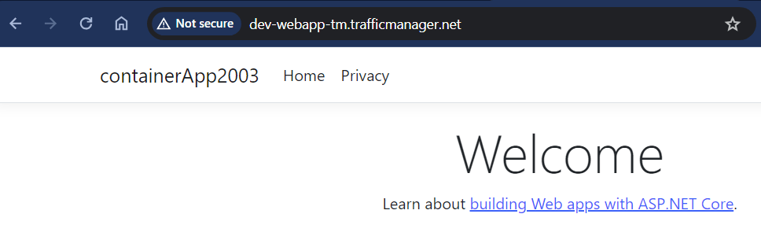

# Introduction

In this blog , we’ll explore how to improve the resiliency of your workloads using Azure Traffic Manager and Azure Chaos Studio. We’ll delve into the concepts of chaos engineering, Traffic Manager, and Chaos Studio, outlining their functionalities and how they work together to ensure application robustness. Additionally, we’ll provide a step-by-step guide for deploying Traffic Manager and Chaos Studio to test your workload’s ability to handle failures.

# Chaos Engineering: Embracing Failure for Success

Chaos engineering is a proactive approach to building reliable systems. It involves intentionally introducing controlled disruptions (faults) to identify weaknesses and potential failure points in your application. By simulating real-world failure scenarios, chaos engineering helps you proactively strengthen your system’s ability to handle unexpected events.

# Azure Chaos Studio: A Playground for Controlled Chaos

Azure Chaos Studio is a managed service specifically designed for chaos engineering within Azure. It provides a platform to define and execute experiments that introduce faults into your applications and infrastructure. Chaos Studio helps you:

* **Identify vulnerabilities**: By simulating failures, you can uncover hidden weaknesses in your system before they cause outages in production.
    
* **Validate recovery mechanisms**: Chaos Studio allows you to test your system’s ability to recover from failures, ensuring your redundancy and failover mechanisms function as expected.
    
* **Build confidence in your deployments**: By successfully navigating simulated failures, you gain confidence in your application’s ability to withstand real-world disruptions.
    

# Azure Traffic Manager: A Balancing Act for Optimal Performance

Azure Traffic Manager is a DNS-based traffic routing service that distributes incoming traffic across your applications and services in a geographically optimal manner. It offers various routing methods, allowing you to tailor traffic flow based on your specific needs. Here’s how Traffic Manager contributes to workload resiliency:

* **High Availability**: Traffic Manager ensures traffic reaches a healthy endpoint even if one of your application instances becomes unavailable. It automatically routes requests to the remaining healthy instances, minimizing downtime and maintaining service continuity.
    
* **Performance Optimization**: Traffic Manager can route users to the closest available endpoint, reducing latency and improving user experience.
    

## The Synergy of Chaos Studio and Traffic Manager

Chaos Studio and Traffic Manager work hand-in-hand to bolster your workload’s resilience. Chaos Studio helps you identify potential failure points in your application, while Traffic Manager provides a safety net by ensuring traffic continues to flow even during disruptions.

Here’s a scenario: Imagine you have an e-commerce application deployed across two regions. Using Chaos Studio, you can simulate a failure in one region. If you have Traffic Manager configured, it will automatically route traffic to the healthy region, minimizing the impact on your customers. By combining these tools, you can proactively build resilience into your system and ensure it can withstand real-world disruptions.

## The Importance of Site Reliability Engineering (SRE) and Observability

Site Reliability Engineering (SRE) is a practice focused on building and maintaining highly reliable and scalable systems. Chaos engineering and Traffic Manager are valuable tools within the SRE toolbox. Observability, the ability to monitor and understand system behavior, plays a crucial role in chaos engineering.

By monitoring system behavior during chaos experiments, you can gain valuable insights into how your application handles faults. This information can be used to identify areas for improvement and enhance your system’s overall resilience.

# Deploying Traffic Manager and Chaos Studio: A Step-by-Step Guide

Let’s walk through the process of deploying Traffic Manager and Chaos Studio to test your workload’s resiliency. As always, we’ll only be using the Portal as a visual aid to validate our progress and change. All steps will be complete using Azure CLI and Bicep templates.

### Step 1: Check Azure Resource Providers

To check the registration status of Choas Studio on your subscripton, run the following command:

```bash
az provider list --query "[?namespace=='Microsoft.Chaos'].registrationState"
```



If you need to register the provider, run the following command:

```bash
az provider register --namespace Microsoft.Chaos
```

This can take between two to five minutes to complete. Rerun the `az provider list` query to confirm the registration has completed.

### Step 2: Deploy Azure Web Apps

We’ll be using Azure Web Apps as our workload for this scenario. Deploy two web apps in different regions to simulate a multi-region deployment. Note: Chaos Studio endpoints aren’t available in all regions, so ensure your web apps are deployed in supported regions [here](https://azure.microsoft.com/en-au/explore/global-infrastructure/products-by-region/?products=chaos-studio).

We’ll be using the following Bicep template to deploy the web apps:

```bash
resource asp 'Microsoft.Web/serverfarms@2023-01-01' = {
  name: aspName
  location: location
  properties: {
    reserved: true
  }
  sku: {
    name: 'S1'
    tier: 'Standard'
    size: 'S1'
    family: 'S'
    capacity: 1
  }
  kind: 'linux'
}

resource webapp 'Microsoft.Web/sites@2023-01-01' = {
  name: webAppName
  location: location
  kind: 'linux'
  identity: {
    type: 'UserAssigned'
    userAssignedIdentities: {
      '${umi.id}': {}
    }
  }
  properties: {
    enabled: true
    // required for the webapp to REALLY be linux. If this is set to false
    // the webapp will be Windows, even though the Kind is set to linux.
    reserved: true
    serverFarmId: asp.id
    publicNetworkAccess: 'Enabled'
    siteConfig: {
      acrUseManagedIdentityCreds: true
      acrUserManagedIdentityID: umi.properties.clientId // not the resource id!
      numberOfWorkers: 1
      linuxFxVersion: 'DOCKER|${acrName}.azurecr.io/${appName}:${appVersion}'
      healthCheckPath: '/'
      alwaysOn: true
    }
  }
}
```

The container image is stored in an Azure Container Registry (ACR). Ensure you have the necessary configurations in place to pull the image during deployment. I covered this in a previous blog post, [Deploying Azure Web Apps with Azure Container Registry](https://benroberts.io/azure-verified-modules-in-action).

%[https://benroberts.io/azure-verified-modules-in-action] 

### Step 3: Create a Chaos Studio Endpoints

Next, we’ll create Chaos Studio endpoints for our web apps. This will allow Chaos Studio to interact with our web apps during experiments. We’ll use the following Bicep template to create the endpoints:

```abap
resource target_appservice 'Microsoft.Chaos/targets@2024-01-01' = {
  scope: webapp
  name: 'microsoft-appservice'
  location: location
  properties: {}
  dependsOn: []
}

resource microsoft_appservice_Stop_1_0 'Microsoft.Chaos/targets/capabilities@2024-01-01' = {
  parent: target_appservice
  name: 'Stop-1.0'
}
```

`Stop-1.0` is a capability that allows Chaos Studio to stop the web app. You can define additional capabilities based on your requirements. See the full list of capabilities [here](https://learn.microsoft.com/en-us/azure/chaos-studio/chaos-studio-fault-library) for more information. Some of the capabilities include simulating high CPU usage, network latency, and disk I/O, just to name a few. Most of capabilities are limited to VM/VMSS (AKS) workloads however.

The `scope` property in the `target_appservice` resource should be set to the resource ID of the web app you want to target. This will allow Chaos Studio to interact with the web app during experiments.

Maintaining the Chaos Studio endpoint within the same module as the web app resources simplifies management and enhances code readability. However, you have the option to organize the endpoint in a separate module, should that better suit your architectural preferences.

### Step 4: Role Based Access Control (RBAC)

To allow Chaos Studio to interact with your web apps, you’ll need to grant the necessary permissions to stop the web app site. This requires the Microsoft.Web/sites/restart/Action, Microsoft.Web/sites/start/Action and Microsoft.Web/sites/Read permissions. Using the principle of least privilege, you can create a custom role with these permissions and assign it to the Chaos Studio service principal. However, for the sake of simplicity, we’ll use the built-in `Website Contributor` role for this example.

Now that we’ve laid the groundwork for our experiment, let’s move on to the Traffic Manager configuration.

```abap
resource roleAssignment 'Microsoft.Authorization/roleAssignments@2022-04-01' = {
  name: guid(resourceGroup().id, umi.name, 'Website Contributor')
  scope: webapp
  properties: {
    principalType: 'ServicePrincipal'
    principalId: umi.properties.principalId
    roleDefinitionId: resourceId('Microsoft.Authorization/roleDefinitions', 'de139f84-1756-47ae-9be6-808fbbe84772')
  }
}
```

### Step 5: Deploy Traffic Manager

Deploy Traffic Manager to route traffic to the web apps in different regions. We’ll use the following Bicep template to create the Traffic Manager profile:

```bash
resource webappAUE 'Microsoft.Web/sites@2023-01-01' existing = {
  scope: resourceGroup(aue_rg)
  name: webAppNameAUE
}

resource webappSEA 'Microsoft.Web/sites@2023-01-01' existing = {
  scope: resourceGroup(sea_rg)
  name: webAppNameSEA
}

resource trafficManagerProfiles 'Microsoft.Network/trafficmanagerprofiles@2022-04-01' = {
  name: profilesName
  location: 'global'
  properties: {
    profileStatus: 'Enabled'
    trafficRoutingMethod: 'Priority'
    dnsConfig: {
      relativeName: profilesName
      ttl: 5
    }
    monitorConfig: {
      protocol: 'HTTPS'
      port: 443
      path: '/'
      intervalInSeconds: 30
      toleratedNumberOfFailures: 3
      timeoutInSeconds: 10
    }
    endpoints: [
      {
        name: '${webAppNameAUE}-endpoint'
        type: 'Microsoft.Network/trafficManagerProfiles/azureEndpoints'
        properties: {
          endpointStatus: 'Enabled'
          endpointMonitorStatus: 'Online'
          targetResourceId: webappAUE.id
          weight: 1
          priority: 1
          endpointLocation: 'Australia East'
          alwaysServe: 'Disabled'
        }
      }
      {
        name: '${webAppNameSEA}-endpoint'
        type: 'Microsoft.Network/trafficManagerProfiles/azureEndpoints'
        properties: {
          endpointStatus: 'Enabled'
          endpointMonitorStatus: 'Online'
          targetResourceId: webappSEA.id
          weight: 1
          priority: 2
          endpointLocation: 'Southeast Asia' // Chaos Studio not available in 'Australia SouthEast'
          alwaysServe: 'Disabled'
        }
      }
    ]
    trafficViewEnrollmentStatus: 'Disabled'
  }
}
```

In this template, we’re creating a Traffic Manager profile with two endpoints: one for each web app in different regions. The `trafficRoutingMethod` is set to `Priority`, meaning traffic will be routed to the endpoint with the highest priority (lowest number) that is healthy. The `monitorConfig` section defines the health check settings for the endpoints.

### Step 6: Deploy Chaos Studio Experiments

Now that we have our web apps, Chaos Studio endpoints, and Traffic Manager in place, we can create a Chaos Studio experiment to test the resiliency of our workload. We’ll use the following Bicep template to define the experiment:

```bash
resource umi 'Microsoft.ManagedIdentity/userAssignedIdentities@2023-07-31-preview' existing = {
  name: umiName
}

resource choasStudio 'Microsoft.Chaos/experiments@2024-01-01' = {
  name: 'dev-aue-cs'
  location: location
  identity: {
    type: 'UserAssigned'
    userAssignedIdentities: {
      '${umi.id}': {}
    }
  }
  properties: {
    selectors: [
      {
        type: 'List'
        targets: [
          {
            id: extensionResourceId(resourceId(aue_rg,'Microsoft.Web/sites',webAppNameAUE),'Microsoft.Chaos/targets','microsoft-appservice')
            type: 'ChaosTarget'
          }
          {
            id: extensionResourceId(resourceId(sea_rg,'Microsoft.Web/sites',webAppNameSEA),'Microsoft.Chaos/targets','microsoft-appservice')
            type: 'ChaosTarget'
          }
        ]
        id: 'ReferenceThisSelector'
      }
    ]
    steps: [
      {
        name: 'Step 1: Failover an App Service web app'
        branches: [
          {
            name: 'Branch 1: Emulate an App Service failure'
            actions: [
              {
                type: 'continuous'
                selectorId: 'ReferenceThisSelector'
                duration: 'PT10M'
                parameters: []
                name: 'urn:csci:microsoft:appService:stop/1.0'
              }
            ]
          }
        ]
      }
    ]
  }
}
```

In the experiment, we’re targeting the Chaos Studio endpoints we created earlier. The experiment consists of a single step that emulates an App Service failure by stopping the web app. The experiment runs for 10 minutes, allowing us to observe how Traffic Manager responds to the failure and routes traffic to the healthy endpoint.

We’re also assigning the user-assigned identity (UMI) to the Chaos Studio experiment we created earlier.

For reference you can find the pipelines and code in my repo:

[https://github.com/broberts23/workload-resil](https://github.com/broberts23/workload-resiliency)[iency](https://github.com/broberts23/workload-resiliency/actions)

### Validation

We’re finally at the point where we can validate our setup! To do this, we’ll run the Chaos Studio experiment and observe the behavior of Traffic Manager. You can monitor the experiment’s progress and view the results in the Chaos Studio portal.



After starting the experiment, we can verify that the web app in the affected region has stopped and that Traffic Manager has successfully routed traffic to the healthy endpoint. This demonstrates the resiliency of our workload and the effectiveness of our Traffic Manager configuration.





# Conclusion

In today’s dynamic and interconnected digital landscape, ensuring the resiliency of cloud workloads is crucial for maintaining business continuity and delivering exceptional user experiences. Technologies like Azure Chaos Studio and Azure Traffic Manager provide organizations with powerful tools to validate system resilience, optimize application availability, and mitigate the impact of failures. By embracing chaos engineering principles, leveraging traffic management solutions, and adopting SRE practices, organizations can build more resilient, scalable, and reliable cloud-based applications.


