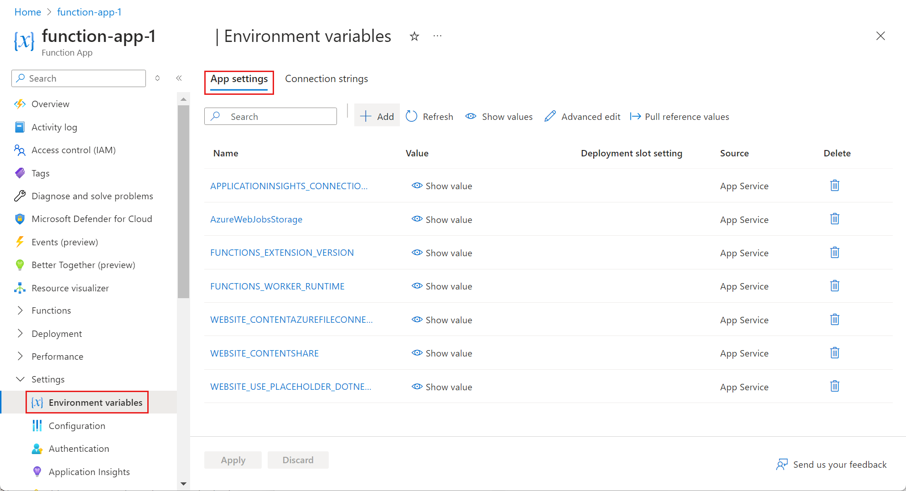

Configuring outbound connectivity for Azure Function Apps is a critical consideration in enterprise environments, especially when balancing security, compliance, and operational requirements. This post explores how to configure proxy settings for Azure Function Apps using environment variables, when to use a proxy versus Azure Firewall, and how to automate these settings in your CI/CD pipeline.

When I ran into this problem, I found a lot of old and conflicting information online. This post aims to clarify the current best practices for configuring proxies in Azure Function Apps, particularly in enterprise scenarios.

## Why Proxy Configuration Matters

In large organizations, outbound traffic from cloud workloads often needs to be controlled for security, auditing, and compliance. Proxies and firewalls are the primary tools for this, but knowing when and how to use each is key to a robust architecture.

## Azure Function App Networking Overview

Azure Function Apps can be integrated with Virtual Networks (VNets), use private endpoints, and route outbound traffic through Azure Firewall or a corporate proxy. Key networking features include:

* **VNet Integration**: Allows your function app to access resources in a private network. When you enable VNet integration, you can use user-defined routes (UDRs) to control how outbound traffic is routed—either directly to the internet, through an Azure Firewall, or to a proxy server. This enables granular control over which traffic is inspected, filtered, or bypassed based on your security requirements.
    
* **Azure Firewall**: Controls and logs outbound traffic at the network level, providing centralized security and compliance enforcement for all protocols.
    
* **Proxies**: Enforce outbound HTTP(S) traffic policies, authentication, and logging. Proxies are typically used for HTTP/S traffic, while firewalls handle all protocols.
    

## Proxy vs. Azure Firewall: When to Use Each

* **Azure Firewall** is ideal for controlling all outbound traffic, including non-HTTP protocols, and provides centralized logging and threat protection.
    
* **Proxy Servers** are best for HTTP(S) traffic, providing granular control, *authentication*, and content filtering.
    
* **Combined Approach**: In many enterprises, HTTP(S) traffic is routed through a proxy, while other protocols go through Azure Firewall. Use route tables (UDRs) and NSGs to direct traffic appropriately.
    

The exception is when you need to route traffic to Azure services, or Microsoft peered services available via express route. In these cases, you may need to bypass the proxy for specific domains or IP ranges

## How Azure Functions Use Proxy Environment Variables

Azure Functions (and App Service) support standard proxy environment variables:

* `ALL_PROXY` or `HTTPS_PROXY`: URL of the proxy server for all outbound HTTP(S) traffic.
    
* `NO_PROXY`: Comma-separated list of hostnames, domains, or IPs to bypass the proxy (e.g., internal APIs, Azure services).
    

**Example values:**

```text
ALL_PROXY: http://proxy.corp.local:8080
NO_PROXY: localhost, .azurewebsites.net, .loganalytics.net, .monitor.azure.com
```

Including domains like `.azurewebsites.net`, `.loganalytics.net`, and `.monitor.azure.com` in your `NO_PROXY` configuration is important because these are core Azure service endpoints that your Function App may need to communicate with directly. For example, `.azurewebsites.net` is used for platform management, Kudu (deployment), and internal service calls; `.loganalytics.net` is required for sending telemetry and diagnostic logs to Azure Monitor; and `.monitor.azure.com` is used for health checks and monitoring integrations. If these domains are routed through a corporate proxy, it can introduce latency, authentication issues, or even block critical platform operations. By explicitly bypassing the proxy for these domains, you ensure reliable connectivity to essential Azure services and avoid disruptions in monitoring, diagnostics, and platform management features. Remembering that NSG and firewall rules should also allow traffic to these domains is crucial.

> **Note:** These variables are picked up by most language runtimes and libraries (e.g., .NET, Node.js, Python) automatically. No code changes are required—set them in the app configuration.

## Default Network Behavior and Environment Proxy Variables

By default, outbound network traffic from Azure Function Apps is routed directly to the internet or through any configured virtual network and firewall, depending on your app’s networking setup. When you set environment variables like `ALL_PROXY` and `NO_PROXY`, the Azure Functions host and the underlying platform automatically use these values to determine which outbound HTTP(S) requests should be sent through a proxy and which should bypass it. This system-level approach ensures that all supported language runtime and libraries (such as .NET, Node.js, and Python) consistently honor your proxy configuration without requiring any changes to your application code. Using environment variables for proxy settings is preferred over hard-coding proxy logic in your function app because it centralizes control, reduces code complexity, and allows you to update proxy settings without redeploying or modifying your application. This method also aligns with enterprise security and compliance practices by ensuring that proxy policies are enforced uniformly across all workloads.

## Setting Proxy Variables in Azure Function App Configuration

1. Go to your Function App in the Azure Portal.
    
2. Navigate to **Configuration** &gt; **Application settings**.
    
3. Add `ALL_PROXY` and `NO_PROXY` as new application settings.
    
4. Save and restart the app.
    

This ensures all outbound HTTP(S) traffic from your function app uses the proxy, except for destinations listed in `NO_PROXY`.



## Example: Enterprise Scenario

Suppose your organization requires all internet-bound HTTP(S) traffic to go through a proxy, but traffic to Azure Storage and internal APIs should bypass the proxy and go through Azure Firewall. You would:

* Set `ALL_PROXY` to your corporate proxy URL.
    
* Set `NO_PROXY` to include Azure service domains and internal address ranges.
    
* Use VNet integration and route tables to ensure non-HTTP(S) traffic is inspected by Azure Firewall.
    

## CI/CD: Setting Proxy Variables in Azure DevOps Pipeline

To automate proxy configuration during deployment (e.g., zipdeploy), add the following to your Azure DevOps YAML pipeline:

```yaml
- task: AzureFunctionApp@1
  displayName: 'Deploy Function App'
  inputs:
    azureSubscription: '$(azureSubscription)'
    appType: functionApp
    appName: '$(functionAppName)'
    package: '$(System.DefaultWorkingDirectory)/drop/yourapp.zip'
    appSettings: -ALL_PROXY "http://proxy.corp.local:8080" -NO_PROXY "localhost, .azurewebsites.net, .loganalytics.net"
```

This YAML snippet sets the proxy environment variables as application settings during the deployment process, ensuring they are applied without needing to modify your function app code.

If your proxy requirements change after deployment, you can update these environment variables directly in the Azure Portal or automate the update using Azure CLI or ARM/Bicep templates as part of your release process. This flexibility allows you to adapt to evolving network and security requirements without redeploying your application code.

## Troubleshooting and Best Practices

* **Test connectivity**: Use the Kudu console or diagnostic tools to verify outbound connectivity and proxy usage.
    
* **Monitor logs**: Ensure your proxy and firewall logs are capturing expected traffic.
    
* **Least privilege**: Only allow required destinations in `NO_PROXY`.
    
* **No code changes**: Always prefer environment variable configuration over hardcoding proxy settings in code.
    
* **Document and review exceptions**: Maintain documentation of all domains and IPs included in your `NO_PROXY` configuration, and review them regularly to ensure they are still required and up to date with Microsoft’s published service tags.
    

## Conclusion

Configuring proxy settings for Azure Function Apps in an enterprise environment is straightforward and robust when using environment variables and infrastructure-as-code. By combining proxy and firewall controls, you can meet security and compliance requirements without sacrificing developer productivity.

---

*For more tips to manage your function app check out the microsoft documentation at* [*learn.microsoft.com*](https://learn.microsoft.com/en-us/azure/azure-functions/functions-how-to-use-azure-function-app-settings?tabs=azure-portal%2Cto-premium)*.*
