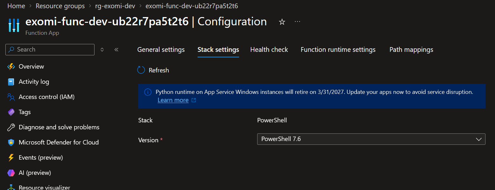
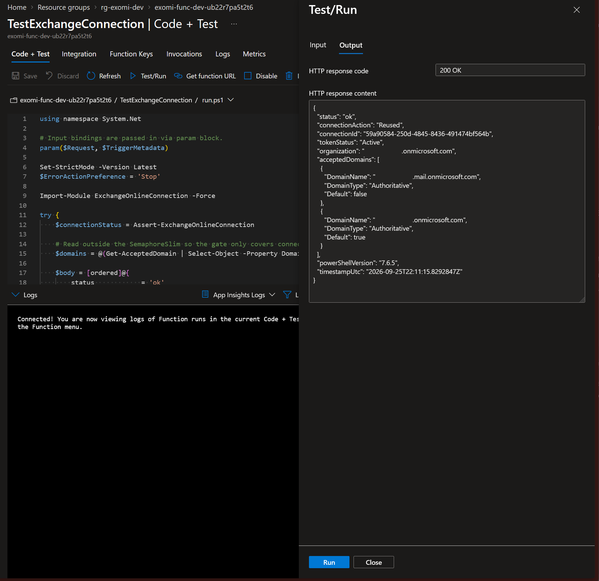
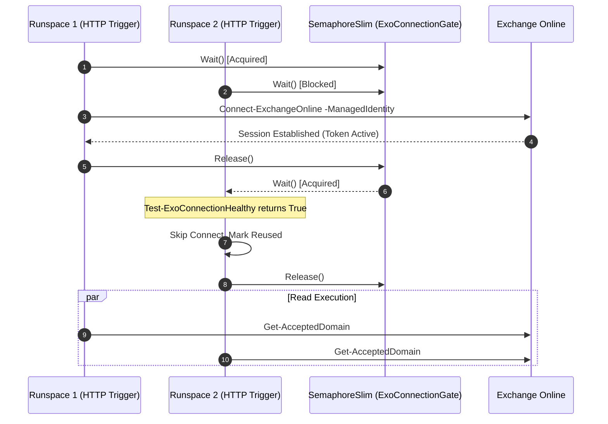
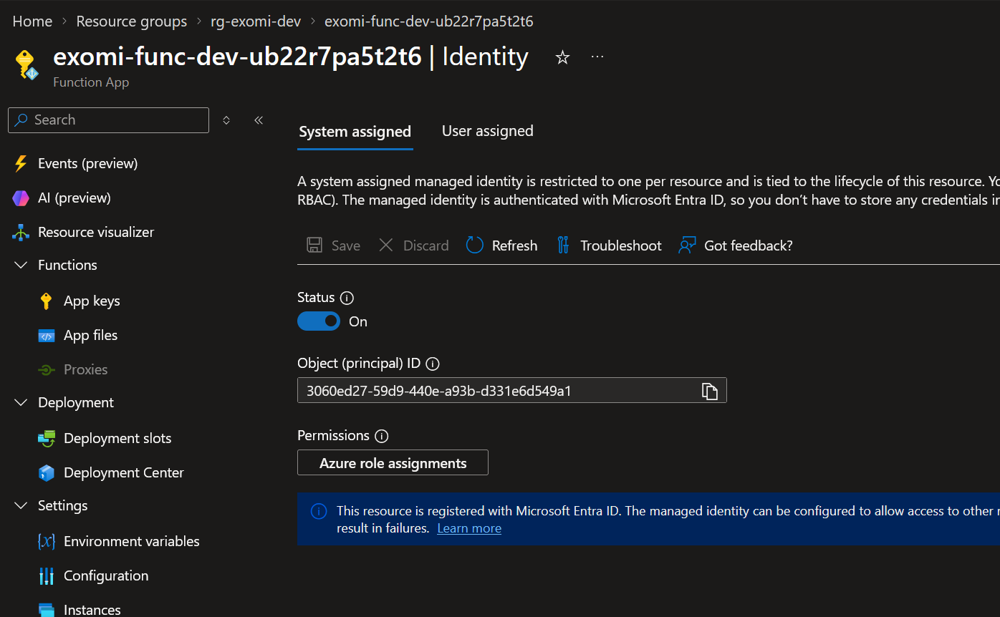
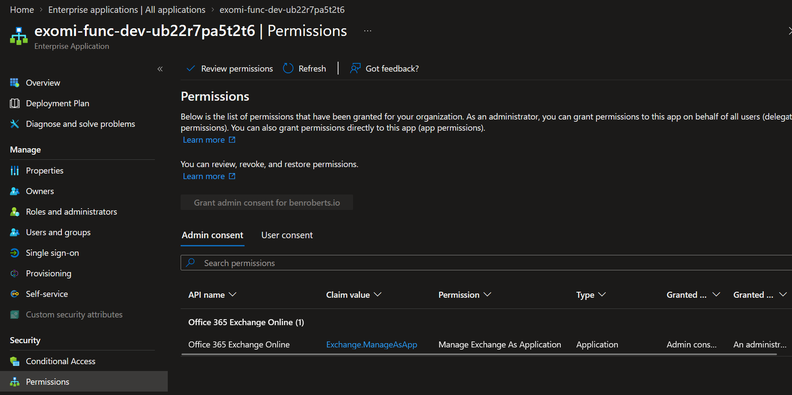
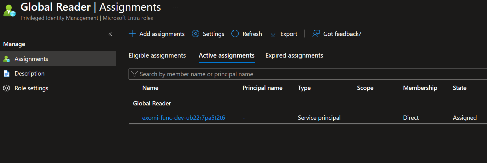
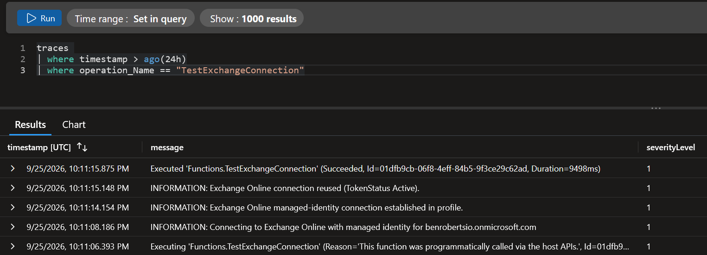

Cold starts are brutal when the workload involves `Connect-ExchangeOnline`. In a PowerShell Azure Function App, authenticating with a managed identity is clean and secretless, but the handshake is notoriously heavy and the Exchange Online Management module has never been modest about memory consumption. If every incoming HTTP request attempts to negotiate its own remote session from scratch, you pay a steep latency penalty every single time. Worse, under modest concurrency, multiple runspaces race to stand up redundant sessions, triggering throttling, memory exhaustion, and erratic gateway timeouts. The architecture here solves this by establishing the connection once when the worker runspace initializes, keeping it warm, and inserting an in-memory gate that serializes any subsequent reconnect or health validation.

Running this on PowerShell 7.6 brings modern runtime capabilities to serverless automation. Because Azure Functions supports PowerShell 7.6 as a preview worker on .NET 10, and version 3.10 of `ExchangeOnlineManagement` specifically targets that .NET 10 baseline, the hosting platform must be Windows Elastic Premium. Consumption plans might look tempting on paper, but Consumption aggressively tears down idle instances, dumping your warm Exchange sessions into the void the second traffic dips. Elastic Premium with a minimum warm instance count guarantees the worker stays alive, turning what would otherwise be a thirty-second handshake into an instant sub-second cmdlet execution.

```mermaid
flowchart TB
  subgraph workerInstance [Function App Process (EP1 Worker)]
    direction TB
    profileInit["profile.ps1 (Cold Start)"] --> acquireGate["Acquire Process Gate"]
    acquireGate --> initConn["Initialize-ExchangeOnlineConnection"]
    initConn --> exoSession[("Exchange Online Session Cache")]
    
    httpReq["HTTP Request (TestExchangeConnection)"] --> assertConn["Assert-ExchangeOnlineConnection"]
    assertConn --> checkGate{"Active Token?"}
    checkGate -- Yes --> reuseSession["Reuse Cached Session"]
    checkGate -- No --> refreshConn["Refresh via Gate"]
    refreshConn --> exoSession
    reuseSession --> execCmdlet["Get-AcceptedDomain"]
  end

  exoSession <-->|"Managed Identity Token"| exchangeCloud["Exchange Online Service"]
```

## Why the session lives in profile.ps1

The Azure Functions runtime invokes `profile.ps1` whenever a new PowerShell runspace spins up inside an instance. This makes it the natural boundary for environmental preparation that every downstream function depends on. Rather than scattering connection boilerplate across individual trigger handlers, the profile handles initialization once at runspace boot.

```powershell
Import-Module ExchangeOnlineConnection -Force
Initialize-ExchangeOnlineConnection
```

The profile script remains lean because the intelligence lives entirely inside the imported module. When `Initialize-ExchangeOnlineConnection` executes, it does not blindly issue an authentication request. Instead, it inspects whether an active, valid connection already exists for the environment before deciding to call `Connect-ExchangeOnline`. On an instance that scales up to handle multiple concurrent runspaces, the secondary runspace boots up, queries connection telemetry, spots the active session, and bypasses the expensive login routine entirely.



## Why refresh lives in the module

Relying solely on startup logic is fragile because cloud tokens expire, worker processes occasionally recycle, and idle remote connections silently drop. If the health check is omitted, an HTTP trigger that arrives three hours after instance creation will execute against a dead session and fail with unhandled transport exceptions. Pushing validation into the helper module ensures every execution verifies the transport state before dispatching commands.

The validation routine tests the current state using `Get-ConnectionInformation`, checking specifically for an `Active` token status. If the session has degraded or expired, it triggers a reconnect under synchronization. Once the session is confirmed healthy, the lock releases immediately so the actual Exchange read operations run concurrently without bottlenecking other threads.

```powershell
function Assert-ExchangeOnlineConnection {
    [CmdletBinding()]
    [OutputType([pscustomobject])]
    param()

    $gate = [ExoConnectionGate]::Instance
    $gate.Wait()
    try {
        if (Test-ExoConnectionHealthy) {
            $connection = @(Get-ConnectionInformation)[0]
            return [pscustomobject]@{
                Action       = 'Reused'
                ConnectionId = $connection.ConnectionId
                TokenStatus  = [string]$connection.TokenStatus
                Organization = $connection.Organization
            }
        }

        Connect-ExoManagedIdentity
        $connection = @(Get-ConnectionInformation)[0]

        return [pscustomobject]@{
            Action       = 'Refreshed'
            ConnectionId = $connection.ConnectionId
            TokenStatus  = [string]$connection.TokenStatus
            Organization = $connection.Organization
        }
    }
    finally {
        $null = $gate.Release()
    }
}
```

The consumer code inside `run.ps1` stays readable and focused on domain logic. It calls `Assert-ExchangeOnlineConnection` to guarantee transport viability, then runs `Get-AcceptedDomain` in parallel with other incoming invocations.

```powershell
$connectionStatus = Assert-ExchangeOnlineConnection
$domains = @(Get-AcceptedDomain | Select-Object -Property DomainName, DomainType, Default)
```



## Why the lock has to be static

Concurrency in the Azure Functions PowerShell worker is controlled by `PSWorkerInProcConcurrencyUpperBound`. Setting this value above one allows multiple runspaces to share the same underlying operating system process. Each runspace possesses its own scope and runs its own copy of `profile.ps1`. If you declare a standard script-scoped synchronization variable inside PowerShell, every runspace gets an isolated copy, which completely fails to prevent two threads from executing `Connect-ExchangeOnline` concurrently during simultaneous cold starts.

To achieve genuine process-wide synchronization, we define a static .NET class hosting a `SemaphoreSlim`. Because .NET types loaded into the runtime AppDomain are shared across all PowerShell runspaces within the worker process, every thread accesses the exact same semaphore handle.

```powershell
if (-not ('ExoConnectionGate' -as [type])) {
    Add-Type -TypeDefinition @'
using System.Threading;
public static class ExoConnectionGate
{
    public static readonly SemaphoreSlim Instance = new SemaphoreSlim(1, 1);
}
'@
}
```

This ensures mutual exclusion across all threads within the process boundary. The first runspace that reaches the gate acquires the single permit, checks whether a session exists, and initiates the connection if necessary. Any concurrent runspaces that arrive while that connection is in flight block gracefully on `Wait()`. By the time the second runspace acquires the semaphore, the session has already been established by the predecessor, so the second thread simply acknowledges the existing connection and returns without calling Exchange. Wrapping the release call in a mandatory `finally` block guarantees that even if the remote endpoint throws an authentication failure, the lock is freed immediately, preventing permanent deadlocks for subsequent requests.



## Managed identity and directory authorization

Establishing a secretless connection requires two distinct permission configurations in Microsoft Entra ID. The first grant lives at the application level. The system-assigned managed identity of the Function App must be granted the `Exchange.ManageAsApp` app role on the well-known Office 365 Exchange Online service principal. This grants the identity permission to access Exchange management APIs as an enterprise background service.





The second grant dictates what management commands the identity can run inside the directory. While interactive administrators often rely on high-privilege built-in roles, automated systems should follow least privilege. Assigning the Microsoft Entra **Global Reader** role to the managed identity satisfies all read requirements for tenant configuration cmdlets like `Get-AcceptedDomain` without granting write access or full administrative control over mailboxes.



While leaning on an Entra directory role like Global Reader works cleanly for a read-only telemetry probe like `Get-AcceptedDomain`, real-world enterprise automations do not stay read-only for long. Production functions are usually built to provision mailboxes, update distribution groups, or adjust recipient configurations. Handing an automated worker the tenant-wide Exchange Administrator role in Microsoft Entra completely shatters the principle of least privilege. In production, you will register the managed identity's service principal inside Exchange Online using `New-ServicePrincipal`, pairing it with `New-ManagementRoleAssignment` to bind granular roles like Recipient Management. That Exchange Application RBAC model confines the automation strictly to recipient lifecycles, and when combined with custom management scopes, ensures the function can touch only the designated mailboxes or organizational units it was built to maintain without exposing the broader directory.

## Observing reuse and refresh in telemetry

The true advantage of the architecture reveals itself in runtime telemetry. When the Function App starts cold, the initial log trace records a session creation event as the managed identity retrieves its OAuth token and builds the local PowerShell runspace snap-in. Subsequent calls hitting the warm instance log a clean reuse event, returning responses in milliseconds because the underlying runspace skips network negotiation entirely.

```powershell
# First invocation after cold start:
INFORMATION: Connecting to Exchange Online with managed identity for contoso.onmicrosoft.com
INFORMATION: Exchange Online connection missing or expired; refreshing.

# Subsequent warm invocation:
INFORMATION: Exchange Online connection reused (TokenStatus Active).
```



## Bringing it all together

Managing Exchange Online sessions inside a serverless runtime requires balancing stateless hosting with stateful remote administration tools. Attempting to open a managed identity connection on every request leads directly to throttling and memory starvation. By front-loading session instantiation into `profile.ps1`, centralizing health verification inside a dedicated module, and anchoring the concurrency lock to a process-wide `SemaphoreSlim`, you achieve a resilient automation engine that handles bursts of traffic without breaking a sweat.

Separating your cloud infrastructure provisioning from directory authorization scripts keeps automation clean and auditable. Infrastructure templates spin up the compute resources and managed identity, dedicated Graph automation applies the required app permissions and directory roles, and standard zip deployment packages the function code. The resulting architecture gives your operations team a rock-solid, secretless foundation for high-throughput Microsoft 365 automation.

## References and technical deep dives

For deeper exploration into thread synchronization, managed identity integration, and Exchange Online administration, consult the following technical documentation:

[System.Threading.SemaphoreSlim Class Documentation](https://learn.microsoft.com/dotnet/api/system.threading.semaphoreslim): Comprehensive API specifications and threading semantics for lightweight semaphores in .NET.

[Connect to Exchange Online PowerShell with Managed Identity](https://learn.microsoft.com/powershell/exchange/connect-exo-powershell-managed-identity): Microsoft guide detailing prerequisites, parameter syntax, and application permission grants for Azure-hosted identities.

[PowerShell Reference for Azure Functions](https://learn.microsoft.com/azure/azure-functions/functions-reference-powershell): Runtime architecture details, concurrency limits, profile execution lifecycle, and PowerShell worker configuration.

[Microsoft Entra Built-in Roles for Exchange](https://learn.microsoft.com/entra/identity/role-based-access-control/permissions-reference): Detailed permission breakdowns for Global Reader, Exchange Administrator, and other directory roles supported by Exchange PowerShell.

[Exchange Online Application RBAC and Scoped Permissions](https://learn.microsoft.com/powershell/exchange/app-only-auth-powershell-v2): Official guide for registering service principals via New-ServicePrincipal and binding targeted roles like Recipient Management.
