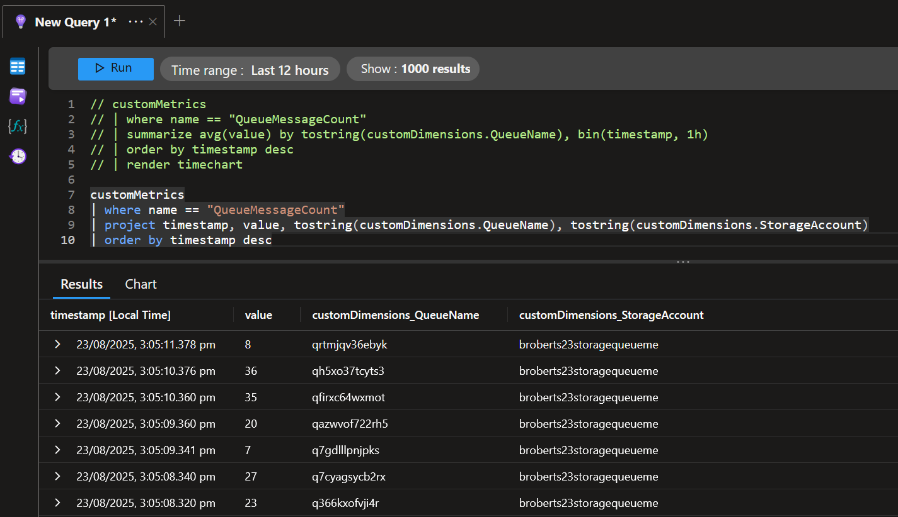
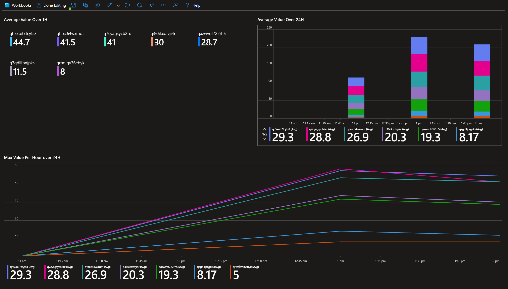

Keeping an eye on Azure Storage Queue backlogs is essential for reliable systems and scale decisions. Most teams want per-queue visibility (not just account-level metrics), simple dashboards/alerts, and a repeatable deployment story. This blog documents a practical approach I use in this GitHub [repo](https://github.com/broberts23/storage-queue-metric). A PowerShell Azure Function that emits per-queue message counts as custom metrics to Application Insights, plus Bicep and GitHub Actions to deploy the environment and seed test data.

We’ll cover the problem, the design, some tricky implementation details (Managed Identity auth, CloudQueue vs QueueClient data paths), and how to visualize the results. Everything shown lives in this repository so you can clone and run it end-to-end.

## The problem and the constraints

* Azure Monitor’s built-in QueueMessageCount for storage accounts is hourly and not split per queue. You can’t retrieve per-queue counts via Azure Monitor metrics.
    
* Teams need per-queue counts at a 5 minute cadence to alert on spikes and monitor backlog trends.
    
* We want secure auth (Managed Identity), no keys in code, and a minimal footprint.
    

## Solution overview

We poll each queue in a storage account with Az.Storage and emit a custom metric per queue to Application Insights using the v2 ingestion endpoint. Workbooks and Metrics Explorer can then visualize and alert on these metrics by the QueueName dimension.

High level flow:

1. Timer-trigger function runs every 5 minutes.
    
2. Uses Managed Identity to authenticate to the storage account data plane.
    
3. Enumerates queues and queries an approximate visible message count per queue.
    
4. Sends a custom metric item per queue to Application Insights with dimensions StorageAccount and QueueName.
    

## Prerequisites and configuration

### RBAC and Managed Identity

The Function App uses a system-assigned managed identity. Assign one of these data-plane roles at the storage account:

* Storage Queue Data Reader (read-only)
    
* Storage Queue Data Contributor (read/write)
    

Then authenticate with `New-AzStorageContext -UseConnectedAccount`. This avoids keys and works well in Functions.

### App settings (environment variables)

The function expects these settings (set as Function App application settings or local environment variables):

* `APPLICATIONINSIGHTS_CONNECTION_STRING` (or `APPINSIGHTS_CONNECTION_STRING`)
    
* `AZURE_SUBSCRIPTION_ID`
    
* `STORAGE_RESOURCE_GROUP`
    
* `STORAGE_ACCOUNT_NAME`
    

## Function implementation (PowerShell)

The function is `functionApp/QueueMessageCount/run.ps1`. It uses Managed Identity via `New-AzStorageContext -UseConnectedAccount` and supports both the legacy WindowsAzure.Storage path and the modern Azure.Storage.Queues path.

Key setup and auth:

```powershell
# Build OAuth data-plane context for queues using the Function App's managed identity
$ctx = New-AzStorageContext -StorageAccountName $StorageAccountName -UseConnectedAccount -ErrorAction Stop

# List queues with AAD context
$queues = Get-AzStorageQueue -Context $ctx -ErrorAction Stop
```

### Why -UseConnectedAccount matters

`-UseConnectedAccount` tells Az.Storage to use the Azure AD token from your current Az context (in Functions, the system-assigned managed identity from `Connect-AzAccount -Identity`) to authenticate to the Storage data plane. That has a few important implications:

* With `-UseConnectedAccount`:
    
    * Data-plane calls are authorized by RBAC. Grant the identity a data-plane role like Storage Queue Data Reader/Contributor and you’re good—no keys in code.
        
    * The returned queue objects are typically backed by the modern Azure.Storage.Queues client, so you’ll find `QueueClient` and should read counts via `QueueClient.GetProperties().Value.ApproximateMessagesCount`.
        
* Without `-UseConnectedAccount`:
    
    * New-AzStorageContext will fall back to shared key or connection-string auth. If you didn’t provide keys/connection string, the context can’t authorize queue data-plane calls and you’ll see 403s or empty/null properties—leading to zeros sent to App Insights.
        
    * If you try to reuse `$storage.Context` from `Get-AzStorageAccount`, it may not contain keys under a managed-identity scenario (listing keys requires management-plane permissions). You’ll end up with an unusable data-plane context.
        

In short: Managed Identity + no keys means use `-UseConnectedAccount`.

* The legacy `CloudQueue` path often isn’t available under AAD; preference the `QueueClient` path when using MI.
    

Reading the data path:

```powershell
# Modern (Azure.Storage.Queues) path
$props = $qref.QueueClient.GetProperties()
$approx = $props.Value.ApproximateMessagesCount
if ($null -ne $approx) { $value = [int]$approx }
```

Sending a metric to Application Insights (v2 track endpoint):

```powershell
$endpoint = $IngestionEndpoint.TrimEnd('/') + '/v2/track'
$env = @{ 
  name = 'Microsoft.ApplicationInsights.Metric'
  time = (Get-Date).ToString('o')
  iKey = $ikey
  data = @{ 
    baseType = 'MetricData'
    baseData = @{ 
      ver = 2
      metrics = @( @{ name = 'QueueMessageCount'; value = [double]$value } )
      properties = @{ StorageAccount = $StorageAccountName; QueueName = $queueName }
    }
  }
}
Invoke-RestMethod -Method Post -Uri $endpoint -ContentType 'application/json' -Body ($env | ConvertTo-Json -Depth 10)
```

How the custom metric works:

* Endpoint and identity:
    
    * We post to the ingestion endpoint from your connection string (`APPLICATIONINSIGHTS_CONNECTION_STRING`) at `.../v2/track`.
        
    * The envelope includes `iKey` (Instrumentation Key); the service uses it to attribute telemetry to your App Insights resource. If it’s missing/invalid, ingestion fails.
        
* Envelope shape (metrics v2):
    
    * `name = 'Microsoft.ApplicationInsights.Metric'` with `data.baseType = 'MetricData'` and `baseData.ver = 2`.
        
    * `baseData.metrics` is an array of one or more metrics. Each item has `name` and a numeric `value` (double). We send one metric: `QueueMessageCount`.
        
    * `baseData.properties` carries dimensions (key/value strings). We set `StorageAccount` and `QueueName`. In Metrics Explorer these become metric dimensions; in Logs they appear under `customDimensions`.
        
* Aggregation and visualization:
    
    * App Insights treats each posted item as a metric sample. In Metrics Explorer, you can aggregate (Avg, Sum, Min, Max) over time and split by `QueueName` to chart per-queue trends.
        
    * In KQL (Logs &gt; customMetrics), numeric samples are available as `value`, and dimensions in `customDimensions`. Example:
        
        ```plaintext
        customMetrics
        | where name == "QueueMessageCount"
        | summarize avg(value) by tostring(customDimensions.QueueName), bin(timestamp, 5m)
        ```
        
* Cardinality and cost:
    
    * Keep dimension cardinality reasonable (queue names are fine). Very high-cardinality dimensions increase metric series and cost.
        
    * Batch by sending an array of envelopes if needed; my function sends one envelope per queue per run, which is typically acceptable.
        

Connection string notes and validating ingestion:

* Connection string vs iKey parsing:
    
    * The modern `APPLICATIONINSIGHTS_CONNECTION_STRING` contains both the ingestion endpoint and the Instrumentation Key. Our function parses the iKey and sets it on each envelope because the raw `/v2/track` endpoint expects an `iKey` on every item.
        
    * If you’d prefer not to parse the iKey yourself, consider using the official Application Insights/ Azure Monitor SDKs which read the connection string and sign telemetry automatically. For direct HTTP calls to `/v2/track`, keep including `iKey` in the envelope.
        
* Validate ingestion quickly:
    
    * Check the HTTP response body from `/v2/track` — it returns counts. Example:
        
        ```powershell
        $resp = Invoke-RestMethod -Method Post -Uri $endpoint -ContentType 'application/json' -Body $bodyJson -ErrorAction Stop
        if ($resp.itemsAccepted -lt $resp.itemsReceived) {
          Write-Warning ("AI ingestion partial success: Accepted={0} Received={1} Errors={2}" -f $resp.itemsAccepted, $resp.itemsReceived, ($resp.errors | ConvertTo-Json -Depth 5))
        }
        ```
        
    * Live Metrics: open Live Metrics in your App Insights resource to confirm the instance is receiving telemetry (requests/dependencies/traces). Custom metrics typically appear in Metrics Explorer within ~1–2 minutes even if they don’t show in Live Metrics streams directly.
        



## Why per-queue via SDK and not Azure Monitor metrics?

Azure’s built-in metric `QueueMessageCount` for `Microsoft.Storage/storageAccounts/queueServices` is sampled hourly and has no per-queue dimension. That’s great for account-level trends, but not for operational backlogs per queue. Reading the approximate visible count with the SDK provides timely, per-queue values suitable for dashboards and alerts.

## Infrastructure as Code (Bicep)

The Bicep file `infra/main.bicep` provisions:

* Storage account (Standard\_LRS)
    
* Queue service and six randomly named queues
    
* App Insights instance
    
* Consumption Function App (PowerShell) with a system-assigned managed identity
    
* A file share for function content settings
    

Notable settings injected into the Function App:

```plaintext
siteConfig: {
  appSettings: [
    { name: 'APPLICATIONINSIGHTS_CONNECTION_STRING', value: appInsights.properties.ConnectionString }
    { name: 'STORAGE_ACCOUNT_NAME', value: st.name }
    { name: 'STORAGE_RESOURCE_GROUP', value: resourceGroup().name }
    { name: 'AZURE_SUBSCRIPTION_ID', value: subscription().subscriptionId }
  ]
}
```

Outputs include the queue names and the storage/account info, which our scripts consume.

## CI/CD with GitHub Actions

Two workflows are included:

* `.github/workflows/deploy.yml` — end-to-end infra + function:
    
    * Logs into Azure via OIDC (don’t forget to store the service principal details as repository secrets. I’ve covered using OIDC to authenticate Github to Azure in depth in previous blogs. You can find more information on how to set up OIDC authentication in parts 4 and 5 of [Azure MLOps Challenge Blog](https://benroberts.io/azure-mlops-challenge-blog-index))
        
    * [Deploys `infra/main.bicep`](https://benroberts.io/azure-mlops-challenge-blog-index)
        
    * Zips `functionApp/` and deploys the Function App
        
    * Runs `scripts/populate-queues.ps1` to add messages
        
* `.github/workflows/deploy-function.yml` — function-only redeploy.
    

These workflows take optional inputs for names, otherwise they auto-generate compliant names.

## Seeding data and repeatable tests (scripts)

Two helper scripts in `scripts/` create sample queues and populate messages using Azure CLI:

* `create-queues.ps1` reads deployment outputs and creates queues:
    

```powershell
$out = az deployment group show --resource-group $ResourceGroup --name $DeploymentName --query properties.outputs -o json | ConvertFrom-Json
$storageName = $out.storageAccount.value
$queues = $out.queueNames.value
$conn = az storage account show-connection-string --resource-group $ResourceGroup --name $storageName -o tsv
foreach ($q in $queues) { az storage queue create --name $q --connection-string $conn }
```

* `populate-queues.ps1` fills each queue with a random number of messages:
    

```powershell
$out = az deployment group show --resource-group $ResourceGroup --name $DeploymentName --query properties.outputs -o json | ConvertFrom-Json
$storageName = $out.storageAccount.value
$queues = $out.queueNames.value
$conn = az storage account show-connection-string --resource-group $ResourceGroup --name $storageName -o tsv
foreach ($q in $queues) {
  $count = Get-Random -Minimum $MinMessages -Maximum ($MaxMessages + 1)
  for ($i = 0; $i -lt $count; $i++) { az storage message put --queue-name $q --content "msg-$([random]::new().Next(100000,999999))" --connection-string $conn }
}
```

These are used automatically in the GitHub workflow after deployment to generate a non-zero baseline for monitoring.

## Visualizing and alerting

You can use either Metrics Explorer or Workbooks.

* Metrics Explorer (App Insights):
    
    * Metric namespace: Custom
        
    * Metric: QueueMessageCount
        
    * Split by: QueueName
        
    * Filter by: StorageAccount if needed
        
* Workbooks (Logs):
    

```plaintext
customMetrics
| where name == "QueueMessageCount"
| summarize avg(value) by tostring(customDimensions.QueueName), bin(timestamp, 5m)
| order by timestamp desc
```

Create a metric alert on the custom metric (dimension: QueueName) or a Log Analytics alert using a scheduled query. You can use the same query to visual the data in Workbooks



## Troubleshooting: why would counts be 0?

* Missing data-plane role: assign Storage Queue Data Reader/Contributor to the Function’s managed identity.
    
* Using account keys but wrong context: prefer `-UseConnectedAccount` with MI.
    
* Wrong data path: on AAD auth, `QueueClient.GetProperties().Value.ApproximateMessagesCount` is the reliable path; `CloudQueue` may not be present.
    
* Immediate staleness: approximate counts lag slightly; verify via a quick `Peek` if in doubt.
    

## Conclusion

Per-queue message counts are not available via Azure Monitor metrics, but they’re straightforward to gather the metrics with Az.Storage and publish as custom metrics in Application Insights. With Managed Identities, Bicep, and GitHub Actions, you can deploy the whole pipeline, seed data, and put dashboards/alerts in front of your team in an hour.

The code here is ready to use with a small footprint and clear extension points (retry/backoff, filtering queues, sampling). Clone the repo, deploy, and start monitoring. 🚀

---

References

* Azure Storage Queues overview: [https://learn.microsoft.com/azure/storage/queues/](https://learn.microsoft.com/azure/storage/queues/)
    
* Application Insights custom metrics: [https://learn.microsoft.com/azure/azure-monitor/app/metrics](https://learn.microsoft.com/azure/azure-monitor/app/metrics)
    
* Az.Storage PowerShell: [https://learn.microsoft.com/powershell/module/az.storage/](https://learn.microsoft.com/powershell/module/az.storage/)
