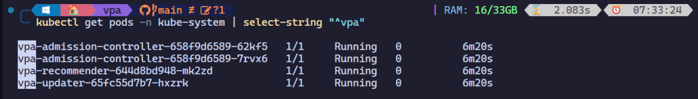
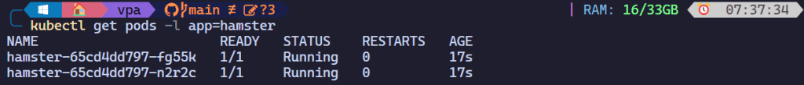
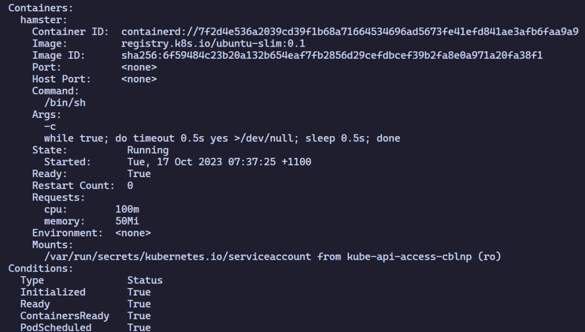
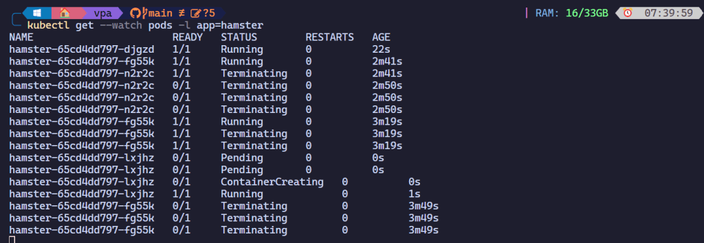
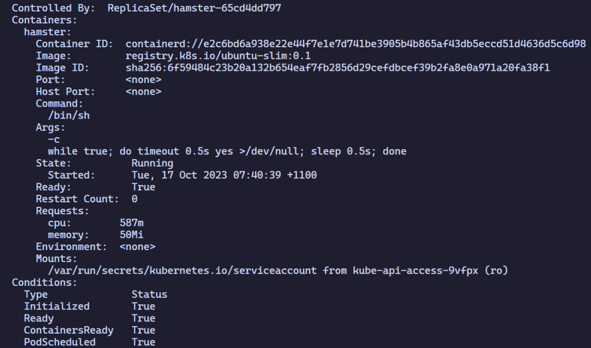
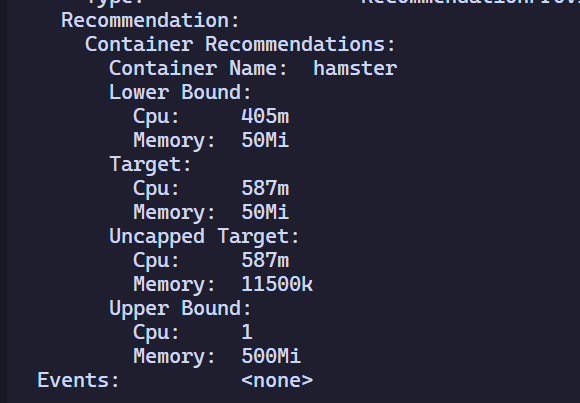

As your Kubernetes workloads grow, it can be challenging to ensure that your pods have the correct resource allocation to run efficiently. That’s where the Azure Kubernetes Service (AKS) Vertical Pod Autoscaler (VPA) comes in.

Vertical Pod Autoscaler is a powerful tool that automatically adjusts the resource requests and limits for your pods based on their actual usage. This ensures that your pods always have the resources they need to run smoothly, without wasting resources or causing performance issues.

## HPA vs. VPA

Horizontal Pod Autoscaler (HPA) and Vertical Pod Autoscaler use the same metrics to complete two fundamentally different tasks. HPA scales “in and “out” by adding *more* or *less* pods, VPA scales “up” and “down” by allocating more or less resources to the *same* number of pods.

Vertical Pod Autoscaler scales based on the *actual* resource usage of each pod. This means VPA can adjust the resource requests and limits for each container individually, ensuring that each pod has the resources it needs to run efficiently. This can lead to significant cost savings and improved performance for your Kubernetes workloads.

## How Vertical Pod Autoscaler Works

When Vertical Pod Autoscaler is enabled on an AKS cluster, the `VerticalPodAutoscaler` API object is added to the Kubernetes autoscaling API group. VPA has three main components and operates as such:

1. The VPA Admission Controller intercepts the pod creation request and adds VPA annotations to the pod spec.
    
2. The VPA **Recommender** collects the resource utilization metrics from the kubelet and uses them to calculate the resource recommendations for each pod.
    
3. The VPA **Updater** monitors the managed pods allowing recreation by their controllers with the new resource spec.
    
4. The VPA **Admission Controller** updates the pod spec with the new resource requests and limits, and the kubelet applies them to the pod.
    

The Vertical Pod Autoscaler object is inserted into each controller, *deployment* being the most common. Vertical Pod Autoscaler has these four operation modes:

* Off: VPA provides recommendations, but does not apply them
    
* Initial: VPA applies recommendations when the pod is created
    
* Recreate: VPA recreates the pod with the new recommendations
    
* Auto: Currently the same as Recreate but will provide in-place updates once restart free operations are available
    

## Best Practices for Configuring AKS Vertical Pod Autoscaler

Now that we’ve compared the features of VPA, let’s dive into some best practices for configuring the AKS VPA:

* Establish observability: You can use Azure Monitor for Containers to collect and analyse the resource utilization metrics of your AKS cluster and pods.
    
* Set the desired requests/limits: You can use `minAllowed` and `maxAllowed` in the `VerticalPodAutoscaler` spec to specify the minimum and maximum resource requests and limits for each container in a pod. These values act as boundaries for the VPA recommendations.
    
* Use VPA with caution: VPA might recommend more resources than are available in the cluster. As a result, this prevents the pod from being assigned to a node and run, because the node doesn’t have sufficient resources. You can overcome this limitation by setting the LimitRange to the maximum available resources per namespace, which ensures pods don’t ask for more resources than specified. Additionally, you can set maximum allowed resource recommendations per pod in the `VerticalPodAutoscaler` spec.
    
* Don’t overlap autoscalers metrics: If VPA and HPA are used in conjunction ensure they’re not scaling based on the same metrics, HPA supports custom metric which should be used in this scenario. You can also use VPA with Cluster Autoscaler, which scales based on the number of nodes in the cluster.
    

## Getting Started with Vertical Pod Autoscaler

To get started with the VPA, you’ll need to have an AKS cluster up and running.

`az aks create -n myAKSDemo -g myResourceGroup --enable-vpa`

After the cluster is created, verify that the Vertical Pod Autoscaler is enabled by running the following command:

`kubectl get pods -n kube-system | select-string "^vpa"`



## Testing Vertical Pod Autoscaler

The following manifest creates a deployment with two pods, each running a single container that requests 100 millicores of CPU and 50 mebibytes of RAM. The VPA config is created too, pointing at the deployment. I’m setting the `updateMode` to Auto, which has the net effect of recreating the pod whenever a change to resource limits is required.

```yaml
---
apiVersion: "autoscaling.k8s.io/v1"
kind: VerticalPodAutoscaler
metadata:
  name: hamster-vpa
spec:
  targetRef:
    apiVersion: "apps/v1"
    kind: Deployment
    name: hamster
  updatePolicy:
    updateMode: "Auto"
  resourcePolicy:
    containerPolicies:
      - containerName: "*"
        minAllowed:
          cpu: 100m
          memory: 50Mi
        maxAllowed:
          cpu: 1
          memory: 500Mi
        controlledResources: ["cpu", "memory"]
---
apiVersion: apps/v1
kind: Deployment
metadata:
  name: hamster
spec:
  selector:
    matchLabels:
      app: hamster
  replicas: 2
  template:
    metadata:
      labels:
        app: hamster
    spec:
      securityContext:
        runAsNonRoot: true
        runAsUser: 65534 # nobody
      containers:
        - name: hamster
          image: registry.k8s.io/ubuntu-slim:0.1
          resources:
            requests:
              cpu: 100m
              memory: 50Mi
          command: ["/bin/sh"]
          args:
            - "-c"
            - "while true; do timeout 0.5s yes >/dev/null; sleep 0.5s; done"
```

You can find the original yaml file [here](https://github.com/kubernetes/autoscaler/blob/master/vertical-pod-autoscaler/examples/hamster.yaml).

Deploy the manifest file with `kubectl apply -f hamster.yml` and wait a few minutes for the pods to deploy.



Inspecting the pod, we can see that the resource request defined the manifest have been met… for now.




For this sample application, the pod needs around 500 millicores to run, so there’s no CPU capacity available initially. The Vertical Pod Autoscaler Recommender analyses the pods hosting the hamster application to see if the CPU and memory requirements are appropriate. If adjustments are needed, the Updater relaunches the pods with updated values.

After a few minutes, the VPA will update the resource requests and limits for the pods and a new pod will be deployed.



You can view the updated values by running the `kubectl describe` command to see the hamster-vpa resource information.



In this screen grab, you can see that the CPU reservation increased to 587 millicores, which is five times the original value. The memory is unchanged at 50 mebibytes. This pod was under-resourced, and the Vertical Pod Autoscaler corrected the original limit with a much more appropriate value.

To view the updated recommendations from VPA, run the `kubectl describe` command to show the hamster-vpa resource information.



## Conclusion

VPA is a powerful tool that can help you optimize the resource usage of your Kubernetes workloads. It can automatically adjust the resource requests and limits for your pods based on their actual usage, ensuring that they always have the resources they need to run efficiently. This can lead to significant cost savings and improved performance for your Kubernetes workloads.

If you’d like more information about Vertical Pod Autoscaler on AKS you can find it [here](https://learn.microsoft.com/en-us/azure/aks/vertical-pod-autoscaler).

I hope you found this article helpful. As always, happy learning!


